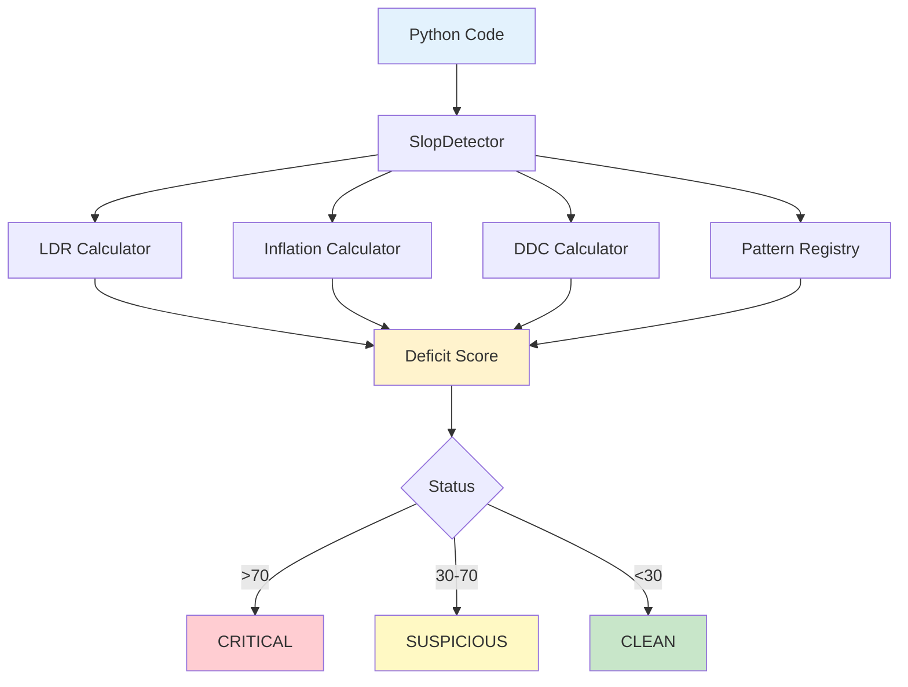

# AI-SLOP Detector

[](https://badge.fury.io/py/ai-slop-detector)
[](https://www.python.org/downloads/)
[](https://opensource.org/licenses/MIT)
[](tests/)
[](htmlcov/)

**Production-grade static analyzer for detecting AI-generated code quality issues.**

Identifies three critical patterns of low-quality AI-generated code:
1. **Empty functions** with placeholder implementations
2. **Buzzword inflation** in documentation without substance
3. **Overhyped comments** claiming revolutionary features for trivial code

---

## Quick Start

```bash
# Install from PyPI
pip install ai-slop-detector

# Analyze a single file
slop-detector analyze mycode.py

# Scan entire project
slop-detector scan ./src --output report.json

# Generate markdown report
slop-detector scan ./src --format markdown --output REPORT.md
```

**[→ Full Installation & Usage Guide](docs/USAGE.md)**

---

## What is AI Slop?

**AI Slop** refers to low-quality code patterns commonly produced by AI code generators:

### Pattern 1: Empty Function Slop
```python
def quantum_encode(self, data):
    '''
    Apply quantum encoding using advanced latent space transformation
    with reinforcement learning policy optimization.
    '''
    pass  # All talk, no implementation
```

### Pattern 2: Buzzword Inflation
```python
class EnterpriseDataProcessor:
    '''
    Cloud-native, microservices-based, serverless enterprise processor
    with Byzantine fault tolerance, neural network-powered validation,
    and quantum-inspired optimization algorithms.
    '''
    def process(self, data):
        return data + 1  # Simple code, overhyped docs
```

### Pattern 3: Overhyped Comments
```python
def add_numbers(a, b):
    # Revolutionary addition using state-of-the-art arithmetic optimization
    result = a + b  # Just regular addition
    
    # Apply advanced result validation with neural network verification
    return result
```

---

## Architecture Overview

AI-SLOP Detector uses a **multi-metric analysis engine** with four core components:



### 1. Logic Density Ratio (LDR)
Measures the ratio of actual logic to empty/placeholder code.
- **High LDR (>75%)**: Well-implemented code
- **Low LDR (<45%)**: Many empty functions or placeholders

### 2. Inflation Calculator
Detects buzzword-to-code ratio in documentation and comments.
- **Low Inflation (<0.5)**: Appropriate technical terminology
- **High Inflation (>2.0)**: Excessive marketing buzzwords

### 3. Dependency Check (DDC)
Identifies unused imports and fake dependencies.
- **High DDC (>70%)**: Clean dependency management
- **Low DDC (<50%)**: Many unused imports

### 4. Pattern Registry (v2.1+)
Detects 12+ anti-patterns including bare except, mutable defaults, TODO/FIXME comments, star imports, and cross-language mistakes.

**[→ Detailed Architecture Documentation](docs/ARCHITECTURE.md)** | **[→ Visual Guide: How It Works](docs/HOW_IT_WORKS.md)**

---

## Real-World Test Results

We tested AI-SLOP Detector on three synthetic codebases:

| Test Case | Deficit Score | Status | Key Issues |
|-----------|---------------|--------|------------|
| **[Case 1: AI Slop](tests/corpus/test_case_1_ai_slop.py)** | 100.0/100 | CRITICAL | 46% LDR, 2.54x inflation, 7 patterns |
| **[Case 2: Fake Docs](tests/corpus/test_case_2_fake_docs.py)** | 78.7/100 | CRITICAL | 3.27x inflation, 64 buzzwords |
| **[Case 3: Hyped Comments](tests/corpus/test_case_3_hyped_comments.py)** | 44.7/100 | INFLATED | 2.28x inflation, 44 buzzwords |

**Case 1 Findings:** 37 buzzwords (neural, transformer, Byzantine fault-tolerant), 4 empty pass functions, 1 bare except clause

**Case 2 Findings:** 64 buzzwords (cloud-native, microservices, quantum-inspired, NeurIPS), simple implementation with overhyped docs, mutable default argument bug

**Case 3 Findings:** 44 buzzwords in inline comments, claims revolutionary algorithm for basic addition, TODO/FIXME comments

**[→ Full Test Report](tests/corpus/DETECTION_REPORT.md)** | **[→ Technical Verification](CRITICAL_PATCH_COMPLETE.md)**

---

## Installation & Usage

```bash
# Install from PyPI
pip install ai-slop-detector

# Basic usage
slop-detector analyze mycode.py
slop-detector scan ./src --config .slopconfig.yaml

# Python API
from slop_detector import SlopDetector
detector = SlopDetector()
result = detector.analyze_file('mycode.py')
print(f'Status: {result.status.value}')
print(f'Deficit: {result.deficit_score:.1f}/100')
```

**[→ Complete Usage Guide](docs/USAGE.md)** | **[→ Configuration Examples](docs/CONFIG_EXAMPLES.md)**

---

## Documentation

### User Guides
- **[Installation & Usage](docs/USAGE.md)** - Comprehensive guide
- **[Configuration](docs/CONFIG_EXAMPLES.md)** - All options
- **[API Reference](docs/API.md)** - Python API docs

### Technical Docs
- **[Architecture](docs/ARCHITECTURE.md)** - System design
- **[Pattern Catalog](docs/PATTERNS.md)** - Anti-patterns
- **[Verification Report](CRITICAL_PATCH_COMPLETE.md)** - QA report

### Examples
- **[Test Results](tests/corpus/DETECTION_REPORT.md)** - Real cases
- **[Enterprise Guide](docs/ENTERPRISE_GUIDE.md)** - Enterprise features

---

## Metrics Explained

**Logic Density Ratio (LDR)**: Percentage of code with actual logic vs empty/placeholder lines
- S++ (>90%): Excellent | A (75-90%): Good | B (60-75%): Acceptable | F (<45%): Critical slop

**Inflation Score**: Buzzword-to-code complexity ratio
- <0.5: Appropriate | 0.5-1.0: Moderate | 1.0-2.0: High | >2.0: Critical inflation

**Deficit Score**: Composite 0-100 score (higher = worse quality)
- CLEAN (<30) | SUSPICIOUS (30-50) | INFLATED_SIGNAL (50-70) | CRITICAL_DEFICIT (>70)

---

## Project Status

- Tests: 34/34 passing (100%)
- Core Coverage: 79%
- Production Ready: ✅
- Latest: v2.5.0 (2026-01-09)

**[→ Changelog](CHANGELOG.md)** | **[→ Contributing](CONTRIBUTING.md)**

---

## Support

- **Issues**: [GitHub Issues](https://github.com/flamehaven01/AI-SLOP-Detector/issues)
- **Email**: info@flamehaven.space

---

<p align='center'>
  <strong>Detect the slop. Maintain quality. Ship with confidence.</strong>
</p>

<p align='center'>
  <a href='https://github.com/flamehaven01/AI-SLOP-Detector'>⭐ Star on GitHub</a> •
  <a href='https://pypi.org/project/ai-slop-detector/'>📦 PyPI</a> •
  <a href='docs/USAGE.md'>📖 Docs</a>
</p>
