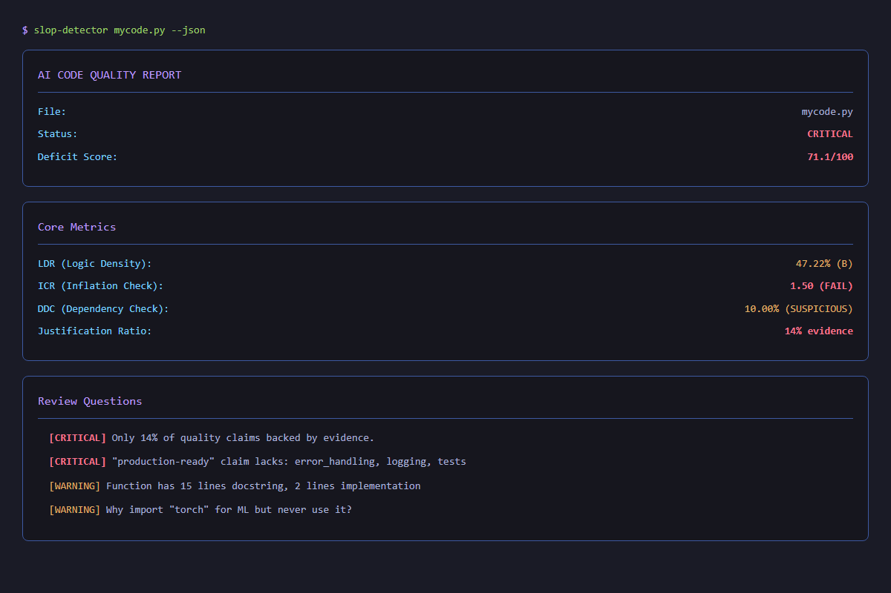

<p align="center">
  
</p>

<h1 align="center">AI-SLOP Detector</h1>

<p align="center">
  <a href="https://pypi.org/project/ai-slop-detector/"></a>
  <a href="https://pypi.org/project/ai-slop-detector/"></a>
  <a href="https://www.python.org/downloads/"></a>
  <a href="https://opensource.org/licenses/MIT"></a>
  <br/>
  <a href="https://github.com/flamehaven01/AI-SLOP-Detector/actions"></a>
  <a href="https://github.com/flamehaven01/AI-SLOP-Detector/actions"></a>
  <a href="htmlcov/"></a>
  <a href="https://github.com/psf/black"></a>
  <a href="https://github.com/flamehaven01/AI-SLOP-Detector/issues"></a>
</p>

<p align="center"><b>Catches the slop that AI produces — before it reaches production.</b></p>

<p align="center">
The problem isn't that AI writes code.<br/>
The problem is the specific class of defects AI reliably introduces:<br/>
unimplemented stubs, disconnected pipelines, phantom imports, and buzzword-heavy noise.<br/>
<br/>
<b>The code speaks for itself.</b>
</p>

---

**Navigation:**
[Quick Start](#quick-start) •
[What's New v2.9.1](#whats-new-in-v291) •
[What It Detects](#what-it-detects) •
[Scoring Model](#scoring-model) •
[History Tracking](#history-tracking) •
[CI/CD](#cicd-integration) •
[Docs](docs/) •
[Changelog](CHANGELOG.md)

---

## Quick Start

```bash
pip install ai-slop-detector

slop-detector mycode.py               # single file
slop-detector --project ./src         # entire project
slop-detector mycode.py --json        # machine-readable output
slop-detector --project . --ci-mode hard --ci-report  # CI gate

# Optional extras
pip install "ai-slop-detector[js]"     # JS/TS tree-sitter analysis
pip install "ai-slop-detector[ml]"     # ML secondary signal
pip install "ai-slop-detector[ml-data]"  # real training data pipeline

# uvx (no install required)
uvx ai-slop-detector mycode.py
```

<p align="center">
  
</p>

---

## What's New in v2.9.1

### Self-Inspection Patch — Zero Deficit Files

v2.9.1 applies the tool to itself and patches what it finds.
Running `slop-detector --project src/` on its own codebase produced three
deficit files. All three are resolved.

**Before → After:**

| Metric | v2.9.0 | v2.9.1 |
| :--- | ---: | ---: |
| Deficit files | 3 | **0** |
| Avg deficit score | 11.65 | **9.57** |
| Weighted deficit score | 15.88 | **12.42** |

**What was fixed:**

**`cli.py` (53.5 → 29.1)** — god function decomposition.
`print_rich_report`, `main`, `generate_markdown_report`, `generate_text_report`,
and `_handle_output` each exceeded the 50-line / complexity-10 threshold.
Extracted 9 focused helpers; every function now fits within limits.

**`registry.py` (39.5 → clean)** — DDC false positive + `global` statement.
`BasePattern` was imported only for type annotations.
`UsageCollector` (by design) skips annotations, so DDC scored it as 0% used.
Fix: move annotation-only imports under `if TYPE_CHECKING:`.
Also replaced lazy `global _global_registry` singleton with eager module-level
initialization, removing the `global` statement the pattern detector flagged.

**`question_generator.py` (30.0 → clean)** — same DDC false positive.
`FileAnalysis` was annotation-only. Same `TYPE_CHECKING` guard fix.
Converted Python 3.10+ union syntax (`int | None`, `str | None`) to
`Optional[int]`, `Optional[str]` for Python 3.8 compatibility.

---

## What's New in v2.9.0

### `phantom_import` — Hallucinated Package Detection (CRITICAL)

AI models sometimes generate plausible-sounding but non-existent package names.
This catches them before they become a runtime `ModuleNotFoundError`.

```python
import tensorflow_magic         # CRITICAL — does not exist
from requests_async_v2 import get  # CRITICAL — does not exist

import numpy                    # OK — installed
from os.path import join         # OK — stdlib
from . import utils              # OK — relative, excluded by design
```

Resolution order: `sys.builtin_module_names` → `sys.stdlib_module_names` →
`importlib.metadata.packages_distributions()` → `importlib.util.find_spec`

Full spec: [docs/PHANTOM_IMPORT.md](docs/PHANTOM_IMPORT.md)

---

### History Auto-Tracking

Every run is recorded to `~/.slop-detector/history.db` automatically.

```bash
slop-detector mycode.py --show-history     # per-file trend
slop-detector --history-trends             # 7-day project aggregate
slop-detector --export-history data.jsonl  # ML training export
slop-detector mycode.py --no-history       # opt-out
```

```
History: src/mymodule.py
----------------------------------------------------------------------
  Timestamp                Deficit    LDR Patterns  Grade
----------------------------------------------------------------------
  2026-03-06T09:12:43         42.0  0.631        7  suspicious
  2026-03-07T11:03:21         18.0  0.812        3  clean
  2026-03-08T14:55:09          0.0  1.000        0  clean
----------------------------------------------------------------------
  Trend (3 runs): improved  delta=-42.0
```

Full spec: [docs/HISTORY_TRACKING.md](docs/HISTORY_TRACKING.md)

---

## What It Detects

**25 patterns across 5 categories.** Full catalog: [docs/PATTERNS.md](docs/PATTERNS.md)

| Category | Patterns | Signal |
|---|---|---|
| **Placeholder** | `empty_except`, `not_implemented`, `pass_placeholder`, `ellipsis_placeholder`, `return_none_placeholder`, `todo_comment`, `fixme_comment`, `hack_comment`, `xxx_comment`, `interface_only_class` | Unfinished / scaffolded code |
| **Structural** | `bare_except`, `mutable_default_arg`, `star_import`, `global_statement` | Anti-patterns |
| **Cross-Language** | `js_push`, `java_equals`, `ruby_each`, `go_print`, `csharp_length`, `php_strlen` | Wrong-language syntax |
| **Python Advanced** | `god_function`, `dead_code`, `deep_nesting`, `lint_escape` | Structural complexity |
| **Phantom** | `phantom_import` | Hallucinated packages |

Beyond patterns, three metric axes are computed per file:

| Metric | What it measures |
|---|---|
| **LDR** (Logic Density Ratio) | `logic_lines / total_lines` — code vs. whitespace/comments |
| **ICR** (Inflation) | `jargon_density × complexity_modifier` — buzzword weight |
| **DDC** (Dependency Check) | `used_imports / total_imports` — import utilization |

---

## Scoring Model

```
deficit_score = w_ldr×(1−ldr) + w_icr×icr_norm + w_ddc×(1−ddc) + pattern_penalty
```

| Score | Status |
|---|---|
| >= 70 | `CRITICAL_DEFICIT` |
| >= 50 | `INFLATED_SIGNAL` |
| >= 30 | `SUSPICIOUS` |
| < 30 | `CLEAN` |

Project aggregation uses SR9 conservative weighting:
`project_ldr = 0.6 × min(file_ldrs) + 0.4 × mean(file_ldrs)`

Full mathematical specification: [docs/MATH_MODELS.md](docs/MATH_MODELS.md)

---

## History Tracking

The history database is the foundation for longitudinal quality analysis.
Files that improve from `deficit=42` to `deficit=0` over multiple runs
provide an independent training signal for the ML pipeline.

```python
from slop_detector.history import HistoryTracker

tracker = HistoryTracker()
regression = tracker.detect_regression("src/api.py", current_score=55.0)
trends = tracker.get_project_trends(days=7)
count = tracker.export_jsonl("training.jsonl")  # → DatasetLoader.load_jsonl()
```

[Full documentation →](docs/HISTORY_TRACKING.md)

---

## CI/CD Integration

```bash
# Soft — informational, never fails build
slop-detector --project . --ci-mode soft --ci-report

# Hard — fails build at deficit_score >= 70 or critical_patterns >= 3
slop-detector --project . --ci-mode hard --ci-report

# Quarantine — escalates repeat offenders after 3 violations
slop-detector --project . --ci-mode quarantine --ci-report
```

**GitHub Actions:**
```yaml
- name: Slop Gate
  run: |
    pip install ai-slop-detector
    slop-detector --project . --ci-mode hard --ci-report
```

[CI/CD Integration Guide →](docs/CI_CD.md)

---

## Configuration

```yaml
# .slopconfig.yaml
weights:
  ldr: 0.40
  inflation: 0.35
  ddc: 0.25

thresholds:
  ldr:
    critical: 0.30
    warning: 0.60

disabled_patterns:
  - lint_escape  # opt-out specific patterns
```

[Full Configuration Guide →](docs/CONFIGURATION.md)

---

## VS Code Extension

Real-time inline diagnostics, debounced lint-on-type, ML score in status bar.

Install from the [VS Code Marketplace](https://marketplace.visualstudio.com/items?itemName=Flamehaven.vscode-slop-detector)
or build locally: `cd vscode-extension && vsce package`

---

## Development

```bash
git clone https://github.com/flamehaven01/AI-SLOP-Detector.git
cd AI-SLOP-Detector
pip install -e ".[dev]"
pytest tests/ -v --cov
black src/ tests/
ruff check src/ tests/
```

[Development Guide →](docs/DEVELOPMENT.md)

---

## License

MIT — see [LICENSE](LICENSE).

---

<p align="center">
  <b>Flamehaven Labs</b> •
  <a href="https://github.com/flamehaven01/AI-SLOP-Detector/issues">Issues</a> •
  <a href="https://github.com/flamehaven01/AI-SLOP-Detector/discussions">Discussions</a> •
  <a href="docs/">Docs</a>
</p>
