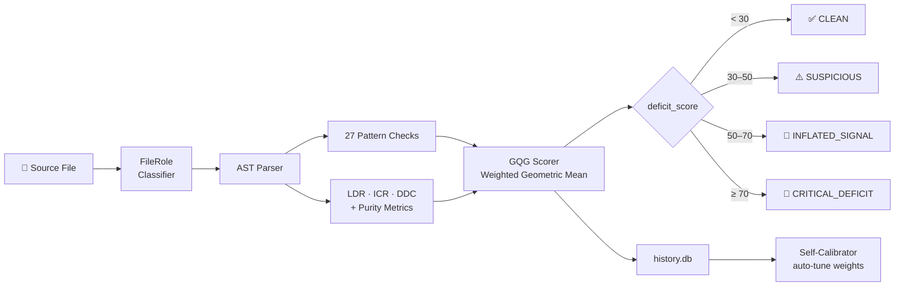
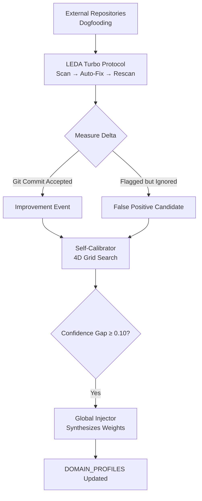

<p align="center">
  
</p>

<h1 align="center">AI-SLOP Detector</h1>

<p align="center">
  <a href="https://pypi.org/project/ai-slop-detector/"></a>
  <a href="https://pepy.tech/project/ai-slop-detector"></a>
  <a href="https://www.python.org/downloads/"></a>
  <a href="https://opensource.org/licenses/MIT"></a>
  <br/>
  <a href="https://github.com/flamehaven01/AI-SLOP-Detector/actions"></a>
  <a href="https://github.com/flamehaven01/AI-SLOP-Detector/actions"></a>
  <a href="htmlcov/"></a>
  <a href="https://github.com/psf/black"></a>
  <a href="https://github.com/flamehaven01/AI-SLOP-Detector/issues"></a>
</p>

<p align="center"><b>Catches the slop that AI produces — before it reaches production.</b></p>

<p align="center"><i>Not a style linter. A structural-risk scanner for AI-assisted code.</i></p>

<p align="center">
The problem isn't that AI writes code.<br/>
The problem is the specific class of defects AI reliably introduces:<br/>
unimplemented stubs, disconnected pipelines, phantom imports, and buzzword-heavy noise.<br/>
<br/>
<b>The code speaks for itself.</b>
</p>

---

**Navigation:**
[What Is It?](#what-is-ai-slop-detector) •
[Quick Start](#quick-start) •
[How It Works](#how-it-works) •
[What It Detects](#what-it-detects) •
[Scoring](#scoring-model) •
[Key Features](#key-features) •
[Calibration](#empirical-weight-calibration-leda) •
[Security](#security-considerations) •
[CI/CD](#cicd-integration) •
[Config](#configuration) •
[VS Code](#vs-code-extension) •
[Changelog](CHANGELOG.md) •
[Release Notes](docs/RELEASE_NOTES.md) •
[Schema Validation](docs/SCHEMA_VALIDATION.md)

---

## What Is AI-SLOP Detector?

AI-SLOP Detector is an **evidence-based static analyzer** purpose-built to catch the specific class of defects that AI code generation reliably introduces — before they reach production.

Unlike general linters that flag style and convention, it targets **AI slop**: structurally plausible code that is functionally empty, disconnected, or misleading.

- **27 adversarial pattern checks** — stubs, phantom imports, disconnected pipelines, buzzword inflation, clone clusters
- **4D scoring model** — LDR (logic density), ICR (inflation), DDC (dependency coupling), Purity (critical severity) combined via geometric mean
- **Self-calibrating** — every scan is recorded per-project; at every 10 multi-run files milestone the calibration check fires automatically; weights update only when 5 improvement events and 5 fp_candidate events have accumulated per class (project-scoped, domain-anchored grid search, no manual command required)
- **Git-aware noise filter** — uses commit SHA to distinguish real improvements from measurement noise
- **Domain-aware bootstrap** — `--init` auto-detects project domain (8 profiles: `general`, `scientific/ml`, `scientific/numerical`, `web/api`, `library/sdk`, `cli/tool`, `bio`, `finance`) and pre-seeds weights accordingly; override with `--domain`
- **JS/TS analysis** — optional `[js]` extra activates JSAnalyzer v2.8.0 with tree-sitter AST + regex fallback for `.js/.jsx/.ts/.tsx` files
- **Go analysis** — optional `[go]` extra activates GoAnalyzer v1.0.0 with regex-based detection for `.go` files; detects empty funcs, panic-as-error, fmt.Print debug, ignored errors
- **CI/CD gates** — soft / hard / quarantine modes; GitHub Actions ready
- **VS Code extension** — real-time inline diagnostics, debounced lint-on-type, ML score in status bar

---

## Quick Start

```bash
pip install "ai-slop-detector>=3.7.3"

slop-detector --init                       # bootstrap .slopconfig.yaml + .gitignore
slop-detector mycode.py                    # single file
slop-detector --project ./src             # entire project
slop-detector mycode.py --json            # machine-readable output
slop-detector --project . --ci-mode hard --ci-report  # CI gate

# Optional extras
pip install "ai-slop-detector[js]"       # JS/TS tree-sitter analysis
pip install "ai-slop-detector[go]"       # Go tree-sitter analysis

# No install required
uvx ai-slop-detector mycode.py
```

<p align="center">
  
</p>

---

## How It Works


```mermaid
flowchart LR
    A[📄 Source File] --> R[FileRole\nClassifier]
    R --> B[AST Parser]
    B --> C[27 Pattern Checks]
    B --> D[LDR · ICR · DDC\n+ Purity Metrics]
    C --> E[GQG Scorer\nWeighted Geometric Mean]
    D --> E
    E --> F{deficit_score}
    F -->|< 30| G[✅ CLEAN]
    F -->|30–50| H[⚠️ SUSPICIOUS]
    F -->|50–70| I[🔶 INFLATED_SIGNAL]
    F -->|≥ 70| J[🚨 CRITICAL_DEFICIT]
    E --> H2[history.db]
    H2 --> K[Self-Calibrator\nauto-tune weights]
```

Every file goes through **four** independent measurement axes (LDR, ICR, DDC,
Purity) **and** 27 pattern checks. Results are combined via a **weighted
geometric mean** — a near-zero in any single dimension pulls the overall score
down regardless of other dimensions. Every scan is recorded to history (per project); at every
10 multi-run files milestone the calibrator fires — weights apply only when >= 5 improvement
events and >= 5 fp_candidate events per class have accumulated.

Full specification: [docs/HOW_IT_WORKS.md](docs/HOW_IT_WORKS.md) · [docs/MATH_MODELS.md](docs/MATH_MODELS.md)

---

## What It Detects

**27 patterns across 5 categories.** Full catalog: [docs/PATTERNS.md](docs/PATTERNS.md)

| Category | Patterns | Signal |
|---|---|---|
| **Placeholder** | `empty_except`, `not_implemented`, `pass_placeholder`, `ellipsis_placeholder`, `return_none_placeholder`, `return_constant_stub`, `todo_comment`, `fixme_comment`, `hack_comment`, `xxx_comment`, `interface_only_class` | Unfinished / scaffolded code |
| **Structural** | `bare_except`, `mutable_default_arg`, `star_import`, `global_statement` | Anti-patterns |
| **Cross-Language** | `javascript_array_push`, `java_equals_method`, `ruby_each`, `go_print`, `csharp_length`, `php_strlen` | Wrong-language syntax |
| **Python Advanced** | `god_function`, `dead_code`, `deep_nesting`, `lint_escape`, `function_clone_cluster`, `placeholder_variable_naming` | Structural complexity + evasion |
| **Phantom** | `phantom_import` | Hallucinated packages |

**Four metric axes per file:**

| Metric | What it measures |
|---|---|
| **LDR** (Logic Density Ratio) | `logic_lines / total_lines` — code vs. whitespace/comments |
| **ICR** (Inflation Check) | `jargon_density × complexity_modifier` — buzzword weight |
| **DDC** (Dependency Check) | `used_imports / total_imports` — import utilization |
| **Purity** | `exp(-0.5 × n_critical_patterns)` — AND-gate on critical pattern severity |

---

## Scoring Model

```
purity        = exp(-0.5 × n_critical_patterns)
quality (GQG) = exp( Σ wᵢ·ln(max(1e-4, dimᵢ)) / Σ wᵢ )   — weighted geometric mean
deficit_score = 100 × (1 − quality) + pattern_penalty
```

`max(1e-4, ...)` prevents `log(0) = -inf` from collapsing the entire score (v3.7.2 `__post_init__` guards enforce upstream range invariants on metric results).

| Score | Status |
|---|---|
| ≥ 70 | `CRITICAL_DEFICIT` |
| ≥ 50 | `INFLATED_SIGNAL` |
| ≥ 30 | `SUSPICIOUS` |
| < 30 | `CLEAN` |

Default weights: `ldr=0.40 · inflation=0.30 · ddc=0.20 · purity=0.10` — sum is 1.00; GQG divides by `total_w` so exact normalization is not required (all four calibrated via `--self-calibrate` in v3.2.0+)
Project aggregation uses SR9 conservative weighting: `0.6 × min + 0.4 × mean`

Full specification: [docs/MATH_MODELS.md](docs/MATH_MODELS.md)

---

## Key Features

**Bootstrap** — domain-aware, one command to start
```bash
slop-detector --init                   # auto-detect domain, generate .slopconfig.yaml
slop-detector --init --domain web/api       # explicit domain override
```
`--init` detects your project domain from file patterns (8 built-in profiles:
`general`, `scientific/ml`, `scientific/numerical`, `web/api`,
`library/sdk`, `cli/tool`, `bio`, `finance`) and pre-seeds the weight profile
accordingly. Also secures `.slopconfig.yaml` in `.gitignore` by default.

---

**JS/TS Analysis** — optional tree-sitter path
```bash
pip install "ai-slop-detector[js]"
slop-detector --project ./src         # now includes .js/.jsx/.ts/.tsx files
```
Activates JSAnalyzer v2.8.0 with tree-sitter AST (regex fallback when not installed).
Results appear under `js_file_results` in `ProjectAnalysis` and JSON output.

---

**Go Analysis** — regex-based, optional tree-sitter-go path
```bash
pip install "ai-slop-detector[go]"
slop-detector --project ./src         # now includes .go files
```
Activates GoAnalyzer v1.0.0. Detects: empty function stubs, `panic()` as error handling,
`fmt.Println/Printf` debug prints, `_ =` ignored errors, TODO/FIXME comments, god functions
(> 60 lines). Results appear under `go_file_results` in JSON output.

---

**Self-Calibration** — the tool learns your codebase
```bash
slop-detector . --self-calibrate               # see what your history recommends
slop-detector . --self-calibrate --apply-calibration  # write to .slopconfig.yaml
```
4D grid-search (ldr / inflation / ddc / purity) over your run history.
Optimizes all four weight dimensions simultaneously.
- **Project-scoped** — `history.db` tags every record with a `project_id` (sha256 of cwd); calibration signal never mixes across different projects
- **Domain-anchored** — grid search is constrained to ±0.15 around the current domain weights, preventing drift outside the domain's meaningful weight region
- **Drift warnings** — `CalibrationResult.warnings` flags any dimension that shifted > 0.25 from the anchor
- Only applies when confidence gap between top two candidates exceeds 0.10
- Milestone is triggered by files re-scanned (not raw record count), avoiding false triggers on first-time project scans

[docs/SELF_CALIBRATION.md →](docs/SELF_CALIBRATION.md)

---

**History Tracking** — longitudinal quality analysis
```bash
slop-detector mycode.py --show-history   # per-file trend
slop-detector --history-trends           # 7-day project aggregate
slop-detector --export-history data.jsonl
```
Every run auto-recorded to `~/.slop-detector/history.db`. The history database is
the training signal for ML self-calibration.
[docs/HISTORY_TRACKING.md →](docs/HISTORY_TRACKING.md)

---

## Claude Code Integration

```bash
cp -r claude-skills/slop-detector ~/.claude/skills/
# restart Claude Code, then use /slop, /slop-file, /slop-gate, /slop-delta, /slop-spar
```

Adds a persistent `scan → diagnose → patch → re-scan → gate → calibrate` quality loop inside Claude Code.

| Command | What it does |
|---|---|
| `/slop` | **3-Phase**: Triage table → Confidence-Routed deep-dive → Action Plan with `→ Next:` guidance |
| `/slop-file [path]` | Single file: status, 4D metrics, per-pattern fix guidance |
| `/slop-gate` | CI-style PASS/FAIL — Path A (SNP gate) or Path B (hard CI mode) |
| `/slop-delta` | Before/after comparison table against session baseline; flags regressions |
| `/slop-spar` | Adversarial calibration validation via `fhval spar` (3 layers) |

**Confidence Routing** (controls Phase 2 depth in `/slop`):

| Status | Score | Action |
|---|---|---|
| `CRITICAL_DEFICIT` | ≥ 70 | Immediate deep-dive — full patch guidance |
| `INFLATED_SIGNAL` | 50–70 | Full deep-dive — action required before merge |
| `SUSPICIOUS` | 30–50 | Run `/slop-file` on top 2 files first; confirm before escalating |
| `CLEAN` | < 30 | Skip Phase 2 — report clean, propose gate |

[Skill source →](claude-skills/slop-detector/SKILL.md) · [Full docs →](docs/CLAUDE_CODE_SKILL.md)

---

## Empirical Weight Calibration (LEDA)

Most static analyzers ship with hand-tuned thresholds — or none at all. AI-SLOP Detector's 4D weights are **empirically synthesized**, not guessed. The oracle is human `git` behavior: a developer committing a flagged fix is an improvement signal; ignoring a flag is a false-positive candidate. Because LDR, DDC, and cyclomatic complexity are AST-derived structural facts, the calibration loop cannot hallucinate its way to a better score — **AI measures, the human judges.**


```mermaid
flowchart TD
    A[External Repositories\nDogfooding] --> B[LEDA Turbo Protocol\nScan → Auto-Fix → Rescan]
    B --> C{Measure Delta}
    C -->|Git Commit Accepted| D[Improvement Event]
    C -->|Flagged but Ignored| E[False Positive Candidate]
    D --> F[Self-Calibrator\n4D Grid Search]
    E --> F
    F --> G{Confidence Gap ≥ 0.10?}
    G -->|Yes| H[Global Injector\nSynthesizes Weights]
    H --> I[DOMAIN_PROFILES Updated]
```

1. **Dogfooding** — `leda_turbo.bat` runs a `Scan → Auto-Fix → Rescan` loop over diverse external codebases, safely applying patterns like `bare_except` and `mutable_default_arg`.
2. **Event Labeling** — deficit drop + git commit = `improvement_event`; flagged and ignored = `fp_candidate`.
3. **Self-Calibration** — 4D grid search (±0.15 domain-anchored). Weights update only when the `confidence_gap` between improvement events and FP candidates exceeds **0.10**.
4. **Global Synthesis** — `global_injector.py` harvests signals across all dogfooding repos, synthesizes a vote-weighted optimal profile, and injects it into `DOMAIN_PROFILES["general"]`.

[LEDA Calibration Docs →](docs/LEDA_CALIBRATION.md) · [Turbo Protocol →](docs/LEDA_TURBO_PROTOCOL_DOGFOODING.md)

---

## Security Considerations

### `.slopconfig.yaml` sensitivity

Your `.slopconfig.yaml` contains `domain_overrides` — a precise map of which functions
are exempt from complexity rules. This is effectively a **codebase weakness surface**:
it reveals which areas are too complex to refactor right now.

**Best practice:**
- Run `slop-detector --init` to generate `.slopconfig.yaml` and auto-add it to `.gitignore`
- To share governance config with your team, explicitly remove `.slopconfig.yaml` from `.gitignore`
- Open-source repos committing it is fine (transparency over obscurity — see this project's own `.slopconfig.yaml`)

### `history.db`

History is stored at `~/.slop-detector/history.db` (your home directory, outside all repos).
It is never committed and accumulates across all projects you scan.

---

**Adversarial Validation (SPAR-Code)** — ground-truth regression guard
```bash
fhval spar          # 3-layer adversarial check
fhval spar --layer a   # known-pattern anchors
fhval spar --layer c   # existence probes
```
Verifies each metric is measuring what it claims. Catches calibration drift
before it reaches production.

---

**Structural Coherence** — project-level signal
```python
project = detector.analyze_project("./src")
print(project.structural_coherence)  # 0.0 – 1.0
```
Experimental. Use for longitudinal comparison within a project, not as an
absolute gate. [docs/ARCHITECTURE.md →](docs/ARCHITECTURE.md)

---

## CI/CD Integration

**pre-commit** (runs on every commit):
```yaml
# .pre-commit-config.yaml
repos:
  - repo: https://github.com/flamehaven01/AI-SLOP-Detector
    rev: v3.7.3
    hooks:
      - id: slop-detector          # hard gate — fails on CRITICAL_DEFICIT >= 70
      # - id: slop-detector-warn   # soft mode — reports only, never blocks
      # - id: slop-detector-patterns  # fast per-file pattern scan
```

**GitHub Actions** (runs on every PR):
```yaml
# .github/workflows/quality-gate.yml
- name: AI-SLOP Gate
  run: |
    pip install "ai-slop-detector>=3.7.3"
    slop-detector --project . --ci-mode hard --ci-report
```

**Enforcement modes:**
```bash
--ci-mode soft        # informational, never fails build
--ci-mode hard        # fails: deficit_score >= 70, critical_patterns >= 3, inflation >= 1.5, ddc < 0.5
--ci-mode quarantine  # escalates repeat offenders after 3 violations
```

[Full CI/CD Integration Guide →](docs/CI_CD.md)

---

## Configuration

```yaml
# .slopconfig.yaml
weights:
  ldr: 0.40
  inflation: 0.30
  ddc: 0.20
  purity: 0.10

patterns:
  god_function:
    domain_overrides:
      - function_pattern: "check_node"   # AST walker — complex by design
        complexity_threshold: 30
        lines_threshold: 200

ignore:
  - "tests/**"
  - "**/__init__.py"
```

[Full Configuration Guide →](docs/CONFIGURATION.md) · [Config Examples →](docs/CONFIG_EXAMPLES.md)

---

## VS Code Extension

Real-time inline diagnostics, debounced lint-on-type, ML score and purity signal in status bar. v3.7.1 rebuilt from a single 855-line monolith into eight focused modules.

**What you see:**

| Surface | Detail |
|---|---|
| Status bar | `$(error) SLOP 45.2` — severity icon + deficit score, updates on save |
| Inline diagnostics | Pattern issues with line references — phantom imports, god functions, lint escapes |
| **TreeView sidebar** | Activity bar panel: files sorted by deficit score, metric rows (LDR/DDC/Purity/Inflation), issue list with click-to-navigate |
| **CodeLens** | Line 0: file summary (`SLOP 45.2 — 3 CRITICAL`); per-function: top severity icon + pattern IDs |
| **QuickFix (CodeAction)** | Lightbulb on `phantom_import`/`god_function`/`lint_escape` diagnostics — show output or add to `.slopconfig.yaml` ignore |
| ML signal | `ML: 73% [slop]` in summary diagnostic when `[ml]` extra is installed |

**Commands (Ctrl+Shift+P > "SLOP"):**

| Command | Description |
|---|---|
| Analyze Current File | On-demand single-file scan |
| Analyze Workspace | Project-wide scan, populates TreeView |
| Auto-Fix Detected Issues | Apply (or dry-run preview) auto-fixable patterns |
| Show Gate Decision (SNP) | PASS/HALT with sr9/di2/jsd/ove metrics |
| Run Cross-File Analysis | Dependency + clone graph across project |
| Show File History | Per-file deficit score trend |
| Show History Trends | 7-day project-wide daily trend table |
| Export History to JSONL | Dump `history.db` records for external analysis |
| Bootstrap .slopconfig.yaml | Domain-aware config generation (`--init`) |
| Run Self-Calibration | LEDA 4D weight optimizer with one-click Apply |

**Install from the [VS Code Marketplace](https://marketplace.visualstudio.com/items?itemName=Flamehaven.vscode-slop-detector)**
or build locally:

```bash
cd vscode-extension
npm install
npx vsce package          # produces vscode-slop-detector-3.7.3.vsix
code --install-extension vscode-slop-detector-3.7.3.vsix
```

**Settings** (`slopDetector.*`): `pythonPath`, `lintOnSave`, `lintOnType`,
`failThreshold` (default 50), `warnThreshold` (default 30), `recordHistory`, `enableCodeLens` (default true).

---

## Release Highlights

| Version | Highlights |
|---|---|
| **v3.7.3** | **Hotfix**: pydantic import wrapped in `try/except ImportError` — package imports cleanly in stripped environments; `test_api_models.py` guard corrected to `fastapi`; CI Docker login `continue-on-error`, quality gate pinned to `>=3.7.3` |
| **v3.7.2** | **Core schema validation**: `config.py` Pydantic guards catch bad `.slopconfig.yaml` at load time (wrong weight types, `domain_overrides` non-int thresholds); `LDRResult` / `DDCResult` / `InflationResult` `__post_init__` clamps protect GQG `math.log()`; `HistoryEntry` sanitises all LEDA calibration inputs + validates `fired_rules` JSON; **VS Code**: `schema.ts` `ISlopReport` interfaces + `parseSlopReport()` handwritten discriminated-union guard — schema mismatch surfaces exact field path before silent NaN |
| **v3.7.1** | `LintEscapePattern` docstring FP fix; self-scan avg_deficit 13.85 → 9.80; `global_injector.py` Patch 1 removed; `.slopconfig.yaml` domain_overrides expanded; **Skill**: 3-Phase Pipeline (Triage → Deep-Dive → Action Plan), `/slop-delta` before/after comparison, Confidence Routing by status band, `→ Next:` guidance per command; **VS Code**: P1 monolith → 8 focused modules, P2 `SlopCodeActionProvider` (QuickFix for phantom_import/god_function/lint_escape), P3 TreeView sidebar (3-level hierarchy), P4 `SlopCodeLensProvider` (file summary + per-function hints) |
| **v3.7.0** | Dogfooding calibration + SKILL.md OSOT repair (10 violations); `cli_renderer.py` split (730 lines → 4 renderer modules); `python_advanced.py` split (1150 lines → 5 modules); BUG-1 `ddc` weight 0.30→0.20; BUG-2 findings filter threshold fix; BUG-3 AST-accurate test counts; BUG-5 block-scoped YAML rewrite in self_calibrator; 314 tests GREEN |
| **v3.6.0** | Claude Code Skill (`/slop`, `/slop-file`, `/slop-gate`, `/slop-spar`); CI gate bugfix (`--ci-mode hard` now exits non-zero without `--ci-report`); pre-commit hooks rewritten (`python -m` entry, 3 hook variants); VS Code Extension v3.6.0 VSIX; docs: Purity row, weight normalization note, `[go]` extra; 311 tests GREEN |
| **v3.5.0** | Domain-aware `--init` (8 profiles, `--domain` flag); JS/TS analysis via JSAnalyzer v2.8.0 + `[js]`; Go analysis via GoAnalyzer v1.0.0 + `[go]`; self-calibration patches: project-scoped history (`project_id`), re-scan milestone trigger, domain-anchored grid search (±0.15), `CalibrationResult.warnings` (drift > 0.25); 308 tests GREEN |
| **v3.4.1** | `FileRole.STUB` (Protocol/ABC stubs skip ldr+patterns); auto-discover `.slopconfig.yaml`; Python 3.8 CI compat; mypy `attr-defined` fix |
| **v3.4.0** | Per-rule FP rate tracking (LEDA Phase 2A); purity weight ceiling `MAX_PURITY_WEIGHT=0.25` (Phase 2B) |
| **v3.3.0** | File role classifier (SOURCE/INIT/RE_EXPORT/TEST/MODEL/CORPUS); DDC annotation-only import fix; `# noqa: F401` + `__all__` re-export recognition |
| **v3.2.1** | Auto-calibration at every 10-scan milestone (no manual cmd); P2 git noise filter; P3 per-class thresholds (5+5); `calibrate()` min_events bugfix; 11/11 e2e GREEN |
| **v3.2.0** | 4D calibration (purity dimension); `--init` bootstrap; auto-calibration hints; 44/44 self-scan CLEAN |
| **v3.1.2** | `data_collector` refactor; slopconfig gap fill; 43/43 self-scan CLEAN |
| **v3.1.1** | Clone Detection in Core Metrics table; table style unification; VS Code UX |
| **v3.1.0** | 3 new adversarial patterns (`function_clone_cluster`, `placeholder_variable_naming`, `return_constant_stub`); GQG calibrator alignment; fhval SPAR-Code |
| **v3.0.2** | Phantom import 3-tier classification; `__init__.py` LDR fix; `god_function` LOW demotion |
| **v3.0.0** | Geometric mean scorer (GQG); `purity` dimension; DCF per-file; structural coherence |
| **v2.9.3** | Self-calibration engine; weight grid-search from usage history |
| **v2.9.0** | `phantom_import` CRITICAL detection; history auto-tracking |

[Full Release Notes →](docs/RELEASE_NOTES.md) · [Changelog →](CHANGELOG.md)

---

## Development

```bash
git clone https://github.com/flamehaven01/AI-SLOP-Detector.git
cd AI-SLOP-Detector
pip install -e ".[dev]"
pytest tests/ -v --cov
black src/ tests/
ruff check src/ tests/
```

[Development Guide →](docs/DEVELOPMENT.md)

---

## Download Stats

<p align="center">
  
</p>

<p align="center">
  <a href="https://pepy.tech/project/ai-slop-detector">
    
  </a>
  &nbsp;
  <a href="https://pepy.tech/project/ai-slop-detector">
    
  </a>
</p>

*Chart updated weekly via [GitHub Actions](.github/workflows/download-chart.yml). Monthly installs: [pypistats.org](https://pypistats.org/packages/ai-slop-detector) (mirrors excluded). Total: [pepy.tech](https://pepy.tech/project/ai-slop-detector) (incl. mirrors)*

---

## License

MIT — see [LICENSE](LICENSE).

---

<p align="center">
  <b>Flamehaven Labs</b> •
  <a href="https://github.com/flamehaven01/AI-SLOP-Detector/issues">Issues</a> •
  <a href="https://github.com/flamehaven01/AI-SLOP-Detector/discussions">Discussions</a> •
  <a href="docs/">Docs</a>
</p>
