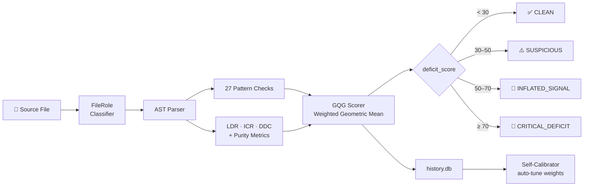
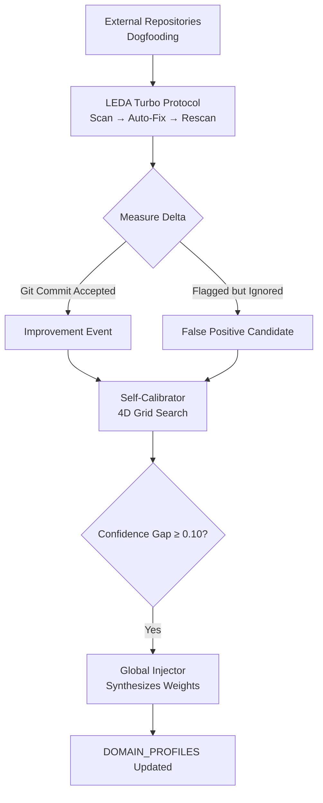

<p align="center">
  
</p>

<h1 align="center">AI-SLOP Detector</h1>

<p align="center">
  <a href="https://pypi.org/project/ai-slop-detector/"></a>
  <a href="https://pepy.tech/project/ai-slop-detector"></a>
  <a href="https://www.python.org/downloads/"></a>
  <a href="https://opensource.org/licenses/MIT"></a>
  <br/>
  <a href="https://github.com/flamehaven01/AI-SLOP-Detector/actions"></a>
  <a href="https://github.com/psf/black"></a>
  <a href="https://github.com/flamehaven01/AI-SLOP-Detector/issues"></a>
</p>

<p align="center"><b>Find AI-generated code that looks finished but isn't.</b></p>

<p align="center">
Catches what a normal linter passes over: empty functions with real-looking bodies, imports of things that don't exist, pipelines wired to nothing, copy-pasted logic, and docs that oversell what the code actually does.<br/>
<b>Runs fully offline &middot; deterministic core scoring &middot; no API key, no model download, nothing leaves your machine.</b>
</p>

**Release track**
- Stable tag: `v3.8.3`
- Previous stable tag: `v3.8.2`
- `v3.8.2` adds adaptive `--init`, a Node/npm transport surface, repo-local impact tracking, and default-off telemetry controls.
- `v3.8.3` adds human-friendly metric output (value / healthy direction / what it means + deficit bands), deterministic Next Steps, and the VS Code webview surfaces; fixes dead-code semantics, adaptive-init config preservation, and `unused-deps` stdlib / dev-tool false positives.

---

**Navigation:**
[What Is It?](#what-is-ai-slop-detector) •
[Why Not a Linter?](#why-not-just-use-a-linter) •
[When Not to Use](#when-not-to-use-this) •
[Quick Start](#quick-start) •
[Verification](#verification-path) •
[Boundaries](#scope-and-boundaries) •
[How It Works](#how-it-works) •
[Document Map](#document-map) •
[What It Detects](#what-it-detects) •
[Scoring](#scoring-model) •
[Key Features](#key-features) •
[Calibration](#empirical-weight-calibration-leda) •
[Security](#security-considerations) •
[CI/CD](#cicd-integration) •
[Config](#configuration) •
[VS Code](#vs-code-extension) •
[Roadmap](ROADMAP.md) •
[Changelog](CHANGELOG.md) •
[Release Notes](docs/RELEASE_NOTES.md) •
[Schema Validation](docs/SCHEMA_VALIDATION.md)

---

## What Is AI-SLOP Detector?

AI-SLOP Detector is an **evidence-based static analyzer** that targets the specific defect class AI code generation reliably produces: structurally plausible code that is functionally empty, disconnected, or misleading.

General linters flag style and convention. This tool flags structural risk.

- **27 checks for "fake-done" code** — empty stubs, imports that don't resolve, dead pipelines, copy-paste clones, and buzzword-padded docs
- **One 0–100 risk score per file** — four measurements are combined so one bad dimension can't be hidden behind good ones (weighted geometric mean of logic density, jargon inflation, dependency use, and critical severity)
- **Gets more accurate the more you use it** — learns from your git history which findings you actually fix versus ignore, and tunes itself per project; no manual training step (kicks in automatically after ~10 multi-run files)
- **Tells real changes from noise** — uses your commit history so a score drifting a point or two isn't mistaken for a real regression
- **Knows your project type** — `--init` detects the domain (web API, data/ML, numerical, CLI, library, bio, finance, or general) and picks sensible defaults; override with `--domain`
- **Python first, JS/TS and Go optional** — install the `[js]` or `[go]` extra to scan those files too
- **Drops into CI** — soft / hard / quarantine gates, GitHub Actions ready
- **VS Code extension** — inline warnings as you type, score in the status bar

---

## Why Not Just Use a Linter?

Ruff, pylint, ESLint, and SonarQube primarily check syntax, style, and general static-quality rules. They'll happily pass code that follows every rule and still does nothing — which is exactly what AI assistants tend to produce. This tool checks the other half: **does the code actually do what it claims?**

| Can it catch... | ruff / pylint / SonarQube | AI-SLOP Detector |
|---|---|---|
| Style, formatting, syntax | Yes | No (not its job) |
| An empty function with a real-looking body or fake return | No | Yes |
| A module imported but never actually used downstream | Partial (unused-import) | Yes (usage ratio) |
| A handler or pipeline that's defined but never wired in | No | Yes |
| Docs or comments that oversell what the code does | No | Yes |
| Copy-pasted duplicate functions across files | Partial | Partial (exact duplicates) |
| Runs offline, no API key, deterministic core score | Yes | Yes |

Use a linter for correctness-of-form. Use this for "is this code real, or just plausible-looking." The two are complementary — run both.

## When NOT to Use This

- **You want style or formatting enforcement** — use ruff / black / ESLint. This tool ignores style on purpose.
- **You need a runtime correctness guarantee** — a low score means cleaner structure, not that the code works. Keep your tests.
- **Your code isn't Python, JS/TS, or Go** — other languages aren't analyzed yet.
- **You expect zero false positives on day one** — the first runs are un-calibrated and learn your project over ~10 multi-run files. Treat early findings as leads, not verdicts.

---

## 60-Second First Run

No project-side config needed. Run it against any folder of Python:

```bash
pip install "ai-slop-detector>=3.8.2"
slop-detector --project . --json --output slop.json
python -c "import json; d=json.load(open('slop.json',encoding='utf-8')); print(d['overall_status'], d['weighted_deficit_score'])"
```

Expected output for a healthy project: `clean 0.0` to `clean 30.0`. Anything
above `30.0` is a real finding worth reading in `slop.json`. The `--output`
form writes UTF-8 (no BOM) directly to disk, so it is safe under Windows
PowerShell — prefer it to `> slop.json` redirection.

## Quick Start

```bash
pip install "ai-slop-detector>=3.8.2"

slop-detector scan .                        # canonical analysis entry
slop-detector review . --json              # canonical changed-code review
slop-detector pulse . --json               # canonical repo health view
slop-detector sweep dead-code . --json     # canonical cleanup family

# legacy / compatible surface
slop-detector --init                       # bootstrap baseline .slopconfig.yaml + .gitignore
slop-detector --init --adaptive-init --init-preview
slop-detector --init --adaptive-init --apply-init-suggestions
slop-detector mycode.py                    # single file
slop-detector --project ./src             # entire project
slop-detector --project . --json --output slop.json   # machine-readable output (Windows-safe)
slop-detector --project . --ci-mode hard --ci-report  # CI gate

# Optional extras
pip install "ai-slop-detector[js]"       # JS/TS tree-sitter analysis
pip install "ai-slop-detector[go]"       # Go tree-sitter analysis

# Thin npm wrapper (delegates to the Python CLI)
npm install --save-dev ai-slop-detector
# or: pnpm add -D ai-slop-detector / yarn add -D ai-slop-detector / bun add -d ai-slop-detector

# Python backend still required
pip install ai-slop-detector

npx ai-slop-detector scan .
npx ai-slop-detector review . --format json
npx ai-slop-detector pulse . --format json
npx ai-slop-detector sweep dead-code . --format json
npx ai-slop-detector mcp

# Typed output contract
import type { ReviewOutput, ScanOutput } from "ai-slop-detector/types"

# Programmatic Node API
import { scanProject, reviewChanges, computeHealth, runCleanupFamily } from "ai-slop-detector"

# Local impact story
slop-detector impact enable .
slop-detector impact .

# Telemetry controls (default: off)
slop-detector telemetry status
slop-detector telemetry inspect --example

# Local wrapper development
cd npm-wrapper
node ./bin/ai-slop-detector.js --version

# No install required
uvx ai-slop-detector mycode.py
```

The npm surface is intentionally thin:

- it does **not** reimplement analysis logic
- it delegates into the Python CLI/runtime
- it exists for Node-first teams that want `npx`-style entry without changing
  product semantics
- it requires a Python backend and discovers it in this order:
  `AI_SLOP_DETECTOR_EXECUTABLE` -> active `VIRTUAL_ENV` -> PATH executables ->
  `python -m slop_detector.cli`
- it ships version-pinned TypeScript interfaces at `ai-slop-detector/types`
- it exports a small async Node API for `scanProject`, `reviewChanges`,
  `computeHealth`, and `runCleanupFamily`

> **Windows / PowerShell tip:** PowerShell `>` redirection writes UTF-16 LE
> or UTF-8 with BOM by default, which breaks `json.load(..., encoding='utf-8')`.
> Use `--output <path>` instead — it writes UTF-8 bytes (no BOM) directly,
> skipping the shell.

<p align="center">
  
</p>

---

## Verification Path

Use the same verification surface the repository exposes in CI:

```bash
pip install -e ".[dev]"
python -m pytest -q
ruff check src tests
python -m build
```

Governance verification is a separate enforcement gate:

```bash
slop-detector verify-governance ./.cr-ep
```

See [docs/GOVERNANCE.md](docs/GOVERNANCE.md) for the artifact contract and
policy checks.

Operational review commands live on the same CLI entry point:

```bash
slop-detector review . --json
slop-detector pulse . --json
slop-detector sweep dead-code . --json
slop-detector sweep dupes . --json
slop-detector sweep unused-deps . --json
slop-detector sweep boundary-violations . --json
slop-detector watch . --follow
slop-detector explain dead-code
```

Legacy command forms such as `audit`, `health`, and direct cleanup-family names
remain supported for compatibility, but `scan / review / pulse / sweep` are the
preferred stable surface.

Cleanup-family semantics are now more operational than a raw candidate list:

- `dead-code`, `dupes`, `unused-deps`, `stale-suppressions`, and
  `boundary-violations` emit `confidence`, `action_class`, and `evidence`
- `unused-deps` includes project-manifest findings such as
  `manifest_unused_dependency` and `undeclared_import`
- `boundary-violations` stays cycle-only by default and only enables layered
  boundary review when architecture rules are explicitly configured

Agent tooling can use the same semantics over MCP stdio:

```bash
slop-detector mcp
# or
slop-mcp
```

Adoption and observability surfaces are intentionally separate from scoring:

- `slop-detector impact` tracks local, gitignored repository progress in
  `.slop-detector/impact.json`
- `slop-detector telemetry` stays default-off and only builds anonymized
  payloads; `AI_SLOP_DETECTOR_TELEMETRY=inspect` prints a real payload without
  queueing it

---

## Scope And Boundaries

- This repository measures static code and documentation signals. It does not prove runtime correctness.
- The default scoring path is deterministic; it does not require an LLM or external API.
- JS/TS and Go support are optional extras with language-specific analyzers and fallbacks.
- Optional Rust acceleration is available for file discovery and glob matching when a compiled `rust/slop_scan` helper is present; otherwise the Python walker remains the fallback.
- Narrow framework-aware masking is enabled for test boilerplate (pytest no-op hooks, test-harness console/no-op hooks in JS/TS) and never masks `critical` findings.
- A low deficit score is evidence of cleaner structure, not a guarantee that the code is complete or safe.

---

## How It Works


```mermaid
flowchart LR
    A[📄 Source File] --> R[FileRole\nClassifier]
    R --> B[AST Parser]
    B --> C[27 Pattern Checks]
    B --> D[LDR · ICR · DDC\n+ Purity Metrics]
    C --> E[GQG Scorer\nWeighted Geometric Mean]
    D --> E
    E --> F{deficit_score}
    F -->|< 30| G[✅ CLEAN]
    F -->|30–50| H[⚠️ SUSPICIOUS]
    F -->|50–70| I[🔶 INFLATED_SIGNAL]
    F -->|≥ 70| J[🚨 CRITICAL_DEFICIT]
    E --> H2[history.db]
    H2 --> K[Self-Calibrator\nauto-tune weights]
```

Every file goes through **four** independent measurement axes (LDR, ICR, DDC,
Purity) **and** 27 pattern checks. Results are combined via a **weighted
geometric mean** — a near-zero in any single dimension pulls the overall score
down regardless of other dimensions. Every scan is recorded to history (per project); at every
10 multi-run files milestone the calibrator fires — weights apply only when >= 5 improvement
events and >= 5 fp_candidate events per class have accumulated.

Full specification: [docs/HOW_IT_WORKS.md](docs/HOW_IT_WORKS.md) · [docs/MATH_MODELS.md](docs/MATH_MODELS.md)
Agent usage: [docs/AGENT_WORKFLOW.md](docs/AGENT_WORKFLOW.md)

---

## Document Map

Use the docs by task, not by chronology:

**Core behavior**
- [docs/ARCHITECTURE.md](docs/ARCHITECTURE.md)
- [docs/HOW_IT_WORKS.md](docs/HOW_IT_WORKS.md)
- [docs/MATH_MODELS.md](docs/MATH_MODELS.md)
- [docs/PATTERNS.md](docs/PATTERNS.md)

**Verification and operations**
- [docs/CI_CD.md](docs/CI_CD.md)
- [docs/VALIDATION.md](docs/VALIDATION.md)
- [docs/SCHEMA_VALIDATION.md](docs/SCHEMA_VALIDATION.md)
- [docs/DEVELOPMENT.md](docs/DEVELOPMENT.md)
- [ROADMAP.md](ROADMAP.md)

**Calibration and history**
- [docs/SELF_CALIBRATION.md](docs/SELF_CALIBRATION.md)
- [docs/LEDA_CALIBRATION.md](docs/LEDA_CALIBRATION.md)
- [docs/LEDA_TURBO_PROTOCOL_DOGFOODING.md](docs/LEDA_TURBO_PROTOCOL_DOGFOODING.md)
- [docs/HISTORY_TRACKING.md](docs/HISTORY_TRACKING.md)
- [docs/GOVERNANCE.md](docs/GOVERNANCE.md)

**Interfaces**
- [docs/CLI_USAGE.md](docs/CLI_USAGE.md)
- [docs/CONFIGURATION.md](docs/CONFIGURATION.md)
- [docs/CONFIG_EXAMPLES.md](docs/CONFIG_EXAMPLES.md)
- [docs/CLAUDE_CODE_SKILL.md](docs/CLAUDE_CODE_SKILL.md)

---

## What It Detects

**27 patterns across 5 categories.** Full catalog: [docs/PATTERNS.md](docs/PATTERNS.md)

| Category | Patterns | Signal |
|---|---|---|
| **Placeholder** | `empty_except`, `not_implemented`, `pass_placeholder`, `ellipsis_placeholder`, `return_none_placeholder`, `return_constant_stub`, `todo_comment`, `fixme_comment`, `hack_comment`, `xxx_comment`, `interface_only_class` | Unfinished / scaffolded code |
| **Structural** | `bare_except`, `mutable_default_arg`, `star_import`, `global_statement` | Anti-patterns |
| **Cross-Language** | `javascript_array_push`, `java_equals_method`, `ruby_each`, `go_print`, `csharp_length`, `php_strlen` | Wrong-language syntax |
| **Python Advanced** | `god_function`, `dead_code`, `deep_nesting`, `lint_escape`, `function_clone_cluster`, `placeholder_variable_naming` | Structural complexity + evasion |
| **Phantom** | `phantom_import` | Hallucinated packages |

**Four metric axes per file:**

| Metric | What it measures |
|---|---|
| **LDR** (Logic Density Ratio) | `logic_lines / total_lines` — code vs. whitespace/comments |
| **ICR** (Inflation Check) | `jargon_density × complexity_modifier` — buzzword weight |
| **DDC** (Dependency Check) | `used_imports / total_imports` — import utilization |
| **Purity** | `exp(-0.5 × n_critical_patterns)` — AND-gate on critical pattern severity |

---

## Scoring Model

```
purity        = exp(-0.5 × n_critical_patterns)
quality (GQG) = exp( Σ wᵢ·ln(max(1e-4, dimᵢ)) / Σ wᵢ )   — weighted geometric mean
deficit_score = 100 × (1 − quality) + pattern_penalty
```

`max(1e-4, ...)` prevents `log(0) = -inf` from collapsing the entire score (v3.7.2 `__post_init__` guards enforce upstream range invariants on metric results).

| Score | Status |
|---|---|
| ≥ 70 | `CRITICAL_DEFICIT` |
| ≥ 50 | `INFLATED_SIGNAL` |
| ≥ 30 | `SUSPICIOUS` |
| < 30 | `CLEAN` |

Default weights: `ldr=0.40 · inflation=0.30 · ddc=0.20 · purity=0.10` — sum is 1.00; GQG divides by `total_w` so exact normalization is not required (all four calibrated via `--self-calibrate` in v3.2.0+)
Project aggregation uses SR9 conservative weighting: `0.6 × min + 0.4 × mean`

Full specification: [docs/MATH_MODELS.md](docs/MATH_MODELS.md)

### Readable, actionable output

Scores are not a black box. Every project and file report renders each metric
with its **value**, **healthy direction**, and a one-line **what it means**, plus
a deficit-band legend:

```
Project Metrics
  Metric                          Value     Healthy   What It Means
  Average Deficit Score           6.1/100   Lower     Mean file risk; 0 is clean, 100 is severe.
  Logic Density Ratio (LDR)       95.36%    Higher    Share of code lines that contain real implementation.
  Inflation-to-Code Ratio (ICR)   0.00x     Lower     Unjustified jargon vs. average cyclomatic complexity.
  Dependency Usage Ratio (DDC)    86.00%    Higher    Imported libraries referenced by runtime code.
  Deficit bands: CLEAN <30 | SUSPICIOUS 30-50 | INFLATED 50-70 | CRITICAL >=70
```

Each report ends with deterministic **Next Steps** — the top concern, the
recommended `sweep` command, and the highest-priority file to open — so analysis
turns directly into action. The same wording is shared by the rich, text, and
markdown renderers.

### Per-file `deficit_breakdown` (v3.7.6)

Every per-file result in the JSON output also carries a `deficit_breakdown`
that attributes the score back to its source dimensions. This answers
"why is my clean-status file not 0.0?" without drilling into raw findings:

| Field | Meaning |
|---|---|
| `ldr_penalty` | Points of deficit attributable to low logic density |
| `inflation_penalty` | Points from buzzword / docstring inflation |
| `ddc_penalty` | Points from low import-usage ratio |
| `purity_penalty` | Points from critical-severity pattern hits via GQG |
| `pattern_hits` | Additive pattern penalty (post-cap) |
| `total` | Equals `deficit_score` (sum of the above when not capped at 100) |

GQG-dimension shares are computed via log-loss attribution — the sum of the
five penalty fields equals `total` within `0.01` when `deficit_score < 100`.

### Structural Coherence Level

`coherence_level` in project-level JSON output reports how the
`structural_coherence` value was derived:

| Value | Meaning | When emitted |
|---|---|---|
| `vr_structural` | Vietoris-Rips H0 persistence over file DCFs (MST max edge) | At least two parsed Python files with non-empty DCFs |
| `vr_structural_approx` | Deterministic approximation of the same signal above the exact topology ceiling | At least two parsed Python files, with file count above `advanced.exact_topology_ceiling` |
| `none` | No coherence computed | Empty project, single file, or all files unparseable |

`mst_persistence` and `not_applicable` are **not** emitted — they were
proposed in the v3.7.5 audit but never wired in. Verify the actual value
from the JSON output rather than guessing.

---

## Key Features

**Bootstrap** — domain-aware, one command to start
```bash
slop-detector --init                   # auto-detect domain, generate .slopconfig.yaml
slop-detector --init --domain web/api       # explicit domain override
slop-detector --init --adaptive-init --init-preview
slop-detector --init --adaptive-init --apply-init-suggestions
```
`--init` detects your project domain from file patterns (8 built-in profiles:
`general`, `scientific/ml`, `scientific/numerical`, `web/api`,
`library/sdk`, `cli/tool`, `bio`, `finance`) and pre-seeds the weight profile
accordingly. Also secures `.slopconfig.yaml` in `.gitignore` by default.

Adaptive init is now a separate safety layer:

- `--init --adaptive-init --init-preview`
  - scans the repository
  - prints evidence-backed config suggestions
  - writes nothing
- `--init --adaptive-init --apply-init-suggestions`
  - opt-in merge path
  - preserves unknown handwritten keys
  - only applies conservative suggestions

---

**JS/TS Analysis** — optional tree-sitter path
```bash
pip install "ai-slop-detector[js]"
slop-detector --project ./src         # now includes .js/.jsx/.ts/.tsx files
```
Activates JSAnalyzer v2.8.0 with tree-sitter AST (regex fallback when not installed).
Results appear under `js_file_results` in `ProjectAnalysis` and JSON output.

---

**Go Analysis** — regex-based, optional tree-sitter-go path
```bash
pip install "ai-slop-detector[go]"
slop-detector --project ./src         # now includes .go files
```
Activates GoAnalyzer v1.0.0. Detects: empty function stubs, `panic()` as error handling,
`fmt.Println/Printf` debug prints, `_ =` ignored errors, TODO/FIXME comments, god functions
(> 60 lines). Results appear under `go_file_results` in JSON output.

---

**Self-Calibration** — the tool learns your codebase
```bash
slop-detector . --self-calibrate               # see what your history recommends
slop-detector . --self-calibrate --apply-calibration  # write to .slopconfig.yaml
```
4D grid-search (ldr / inflation / ddc / purity) over your run history.
Optimizes all four weight dimensions simultaneously.
- **Project-scoped** — `history.db` tags every record with a `project_id` (sha256 of cwd); calibration signal never mixes across different projects
- **Domain-anchored** — grid search is constrained to ±0.15 around the current domain weights, preventing drift outside the domain's meaningful weight region
- **Drift warnings** — `CalibrationResult.warnings` flags any dimension that shifted > 0.25 from the anchor
- Only applies when confidence gap between top two candidates exceeds 0.10
- Milestone is triggered by files re-scanned (not raw record count), avoiding false triggers on first-time project scans

[docs/SELF_CALIBRATION.md →](docs/SELF_CALIBRATION.md)

---

**History Tracking** — longitudinal quality analysis
```bash
slop-detector mycode.py --show-history   # per-file trend
slop-detector --history-trends           # 7-day project aggregate
slop-detector --export-history data.jsonl
```
Every run auto-recorded to `~/.slop-detector/history.db`. The history database is
the training signal for ML self-calibration.
[docs/HISTORY_TRACKING.md →](docs/HISTORY_TRACKING.md)

---

## Claude Code Integration

```bash
cp -r claude-skills/slop-detector ~/.claude/skills/
# restart Claude Code, then use /slop, /slop-file, /slop-gate, /slop-delta, /slop-spar
```

Adds a persistent `scan → diagnose → patch → re-scan → gate → calibrate` quality loop inside Claude Code.

| Command | What it does |
|---|---|
| `/slop` | **3-Phase**: Triage table → Confidence-Routed deep-dive → Action Plan with `→ Next:` guidance |
| `/slop-file [path]` | Single file: status, 4D metrics, per-pattern fix guidance |
| `/slop-gate` | CI-style PASS/FAIL — Path A (SNP gate) or Path B (hard CI mode) |
| `/slop-delta` | Before/after comparison table against session baseline; flags regressions |
| `/slop-spar` | Adversarial calibration validation via `fhval spar` (3 layers) |

**Confidence Routing** (controls Phase 2 depth in `/slop`):

| Status | Score | Action |
|---|---|---|
| `CRITICAL_DEFICIT` | ≥ 70 | Immediate deep-dive — full patch guidance |
| `INFLATED_SIGNAL` | 50–70 | Full deep-dive — action required before merge |
| `SUSPICIOUS` | 30–50 | Run `/slop-file` on top 2 files first; confirm before escalating |
| `CLEAN` | < 30 | Skip Phase 2 — report clean, propose gate |

[Skill source →](claude-skills/slop-detector/SKILL.md) · [Full docs →](docs/CLAUDE_CODE_SKILL.md)

---

## Empirical Weight Calibration (LEDA)

Most static analyzers ship with hand-tuned thresholds — or none at all. AI-SLOP Detector's 4D weights are **empirically synthesized**, not guessed. The oracle is human `git` behavior: a developer committing a flagged fix is an improvement signal; ignoring a flag is a false-positive candidate. Because LDR, DDC, and cyclomatic complexity are AST-derived structural facts, the calibration loop cannot hallucinate its way to a better score — **AI measures, the human judges.**


```mermaid
flowchart TD
    A[External Repositories\nDogfooding] --> B[LEDA Turbo Protocol\nScan → Auto-Fix → Rescan]
    B --> C{Measure Delta}
    C -->|Git Commit Accepted| D[Improvement Event]
    C -->|Flagged but Ignored| E[False Positive Candidate]
    D --> F[Self-Calibrator\n4D Grid Search]
    E --> F
    F --> G{Confidence Gap ≥ 0.10?}
    G -->|Yes| H[Global Injector\nSynthesizes Weights]
    H --> I[DOMAIN_PROFILES Updated]
```

1. **Dogfooding** — `leda_turbo.bat` runs a `Scan → Auto-Fix → Rescan` loop over diverse external codebases, safely applying patterns like `bare_except` and `mutable_default_arg`.
2. **Event Labeling** — deficit drop + git commit = `improvement_event`; flagged and ignored = `fp_candidate`.
3. **Self-Calibration** — 4D grid search (±0.15 domain-anchored). Weights update only when the `confidence_gap` between improvement events and FP candidates exceeds **0.10**.
4. **Global Synthesis** — `global_injector.py` harvests signals across all dogfooding repos, synthesizes a vote-weighted optimal profile, and injects it into `DOMAIN_PROFILES["general"]`.

[LEDA Calibration Docs →](docs/LEDA_CALIBRATION.md) · [Turbo Protocol →](docs/LEDA_TURBO_PROTOCOL_DOGFOODING.md)

---

## Security Considerations

### `.slopconfig.yaml` sensitivity

Your `.slopconfig.yaml` contains `domain_overrides` — a precise map of which functions
are exempt from complexity rules. This is effectively a **codebase weakness surface**:
it reveals which areas are too complex to refactor right now.

**Best practice:**
- Run `slop-detector --init` to generate `.slopconfig.yaml` and auto-add it to `.gitignore`
- To share governance config with your team, explicitly remove `.slopconfig.yaml` from `.gitignore`
- Open-source repos committing it is fine (transparency over obscurity — see this project's own `.slopconfig.yaml`)

### `history.db`

History is stored at `~/.slop-detector/history.db` (your home directory, outside all repos).
It is never committed and accumulates across all projects you scan.

---

**Adversarial Validation (SPAR-Code)** — ground-truth regression guard
```bash
fhval spar          # 3-layer adversarial check
fhval spar --layer a   # known-pattern anchors
fhval spar --layer c   # existence probes
```
Verifies each metric is measuring what it claims. Catches calibration drift
before it reaches production.

---

**Structural Coherence** — project-level signal
```python
project = detector.analyze_project("./src")
print(project.structural_coherence)  # 0.0 – 1.0
```
Experimental. Use for longitudinal comparison within a project, not as an
absolute gate. Exact MST topology is used up to
`advanced.exact_topology_ceiling` (default `300` files); above that the engine
switches to a deterministic approximation and reports
`coherence_level = "vr_structural_approx"`. [docs/ARCHITECTURE.md →](docs/ARCHITECTURE.md)

---

## CI/CD Integration

**pre-commit** (runs on every commit):
```yaml
# .pre-commit-config.yaml
repos:
  - repo: https://github.com/flamehaven01/AI-SLOP-Detector
    rev: v3.7.3
    hooks:
      - id: slop-detector          # hard gate — fails on CRITICAL_DEFICIT >= 70
      # - id: slop-detector-warn   # soft mode — reports only, never blocks
      # - id: slop-detector-patterns  # fast per-file pattern scan
```

**GitHub Actions** (runs on every PR):
```yaml
# .github/workflows/quality-gate.yml
- name: AI-SLOP Gate
  run: |
    pip install "ai-slop-detector>=3.7.3"
    slop-detector --project . --ci-mode hard --ci-report
```

**Enforcement modes:**
```bash
--ci-mode soft        # informational, never fails build
--ci-mode hard        # fails: deficit_score >= 70, critical_patterns >= 3, inflation >= 1.5, ddc < 0.5
--ci-mode quarantine  # escalates repeat offenders after 3 violations
```

[Full CI/CD Integration Guide →](docs/CI_CD.md)

---

## Configuration

```yaml
# .slopconfig.yaml
weights:
  ldr: 0.40
  inflation: 0.30
  ddc: 0.20
  purity: 0.10

patterns:
  god_function:
    domain_overrides:
      - function_pattern: "check_node"   # AST walker — complex by design
        complexity_threshold: 30
        lines_threshold: 200

ignore:
  - "tests/**"
  - "**/__init__.py"

advanced:
  exact_topology_ceiling: 300
  topology_mode_above_ceiling: deterministic_approximate
  analysis_cache_enabled: true
  analysis_cache_db: ""
  churn_commit_window: 200
  coverage_data_file: ".coverage"
  hotspot_limit: 10
  hotspot_weights:
    deficit: 0.50
    churn: 0.30
    coverage_gap: 0.20

architecture:
  enabled: true
  preset: layered
  layers: []
```

[Full Configuration Guide →](docs/CONFIGURATION.md) · [Config Examples →](docs/CONFIG_EXAMPLES.md)

---

## Inline Suppression

Use inline suppression when a specific local exception is intentional and should
remain visible in audit output:

```python
# slop-disable-next-line bare_except
except:
    pass

# slop-disable all
def compatibility_layer():
    ...
# slop-enable all
```

- `# slop-disable-next-line <pattern_id|all>`
- `# slop-disable <pattern_id|all>`
- `# slop-enable <pattern_id|all>`

Suppressed findings are removed from scoring, but they are still recorded in the
suppression ledger so reviewers can see which lines were muted.

---

## Repeated-Run Cache

Repeated Python-file analysis can reuse prior results through the SQLite-backed
metadata cache:

```yaml
advanced:
  analysis_cache_enabled: true
  analysis_cache_db: ""  # empty = default user cache under ~/.slop-detector/
```

- Cache keys include file path, size, `mtime`, content hash, engine version, and config fingerprint.
- A changed file or changed config invalidates only the affected entries.
- Current scope is Python file analysis reuse; project aggregation still recomputes from the live file set.

---

## Priority Hotspots

Project scans now rank repair order instead of only printing static scores.
The hotspot layer combines:

- deficit score
- recent git churn
- coverage gap from `.coverage`

When present, the report highlights files that are both sloppy and risky to
change because they churn often or remain under-tested. If git metadata or
coverage data is missing, the prioritization layer degrades gracefully instead
of failing the scan.

---

## Agent Surface

The FastAPI server exposes an agent-native contract alongside the existing
human-oriented `/analyze/*` routes:

- `GET /agent/schema`
- `POST /agent/file`
- `POST /agent/project`

These routes return structured snapshots with summary metrics, suppression
metadata, hotspot ranking, and the raw analysis payload so tools can consume
the results without scraping text output.

---

## VS Code Extension

Real-time inline diagnostics, debounced lint-on-type, ML score and purity signal in status bar. v3.7.1 rebuilt from a single 855-line monolith into eight focused modules.

**What you see:**

| Surface | Detail |
|---|---|
| Status bar | `$(error) SLOP 45.2` — severity icon + deficit score, updates on save |
| Inline diagnostics | Pattern issues with line references — phantom imports, god functions, lint escapes |
| **TreeView sidebar** | Activity bar panel: files sorted by deficit score, metric rows (LDR/DDC/Purity/Inflation), issue list with click-to-navigate |
| **CodeLens** | Line 0: file summary (`SLOP 45.2 — 3 CRITICAL`); per-function: top severity icon + pattern IDs |
| **QuickFix (CodeAction)** | Lightbulb on `phantom_import`/`god_function`/`lint_escape` diagnostics — show output or add to `.slopconfig.yaml` ignore |
| ML signal | `ML: 73% [slop]` in summary diagnostic when `[ml]` extra is installed |

**Commands (Ctrl+Shift+P > "SLOP"):**

| Command | Description |
|---|---|
| Analyze Current File | On-demand single-file scan |
| Analyze Workspace | Project-wide scan, populates TreeView |
| Show 4D Breakdown | Webview: penalty attribution — why a file is not 0.0 |
| Show Cleanup Plan | Webview: confidence-ranked `sweep` family (safe/needs/unsafe) |
| Show Pulse Dashboard | Webview: project health + priority hotspots |
| Show Changed-Code Review | Webview: diff-aware review, new-vs-inherited slop |
| Auto-Fix Detected Issues | Apply (or dry-run preview) auto-fixable patterns |
| Show Gate Decision (SNP) | PASS/HALT with sr9/di2/jsd/ove metrics |
| Run Cross-File Analysis | Dependency + clone graph across project |
| Show File History | Per-file deficit score trend |
| Show History Trends | 7-day project-wide daily trend table |
| Export History to JSONL | Dump `history.db` records for external analysis |
| Bootstrap .slopconfig.yaml | Domain-aware config generation (`--init`) |
| Run Self-Calibration | LEDA 4D weight optimizer with one-click Apply |

**Install from the [VS Code Marketplace](https://marketplace.visualstudio.com/items?itemName=Flamehaven.vscode-slop-detector)**
or build locally:

```bash
cd vscode-extension
npm install
npx vsce package          # produces vscode-slop-detector-3.7.3.vsix
code --install-extension vscode-slop-detector-3.7.3.vsix
```

**Settings** (`slopDetector.*`): `pythonPath`, `lintOnSave`, `lintOnType`,
`failThreshold` (default 50), `warnThreshold` (default 30), `recordHistory`, `enableCodeLens` (default true).

---

## Release Highlights

| Version | Highlights |
|---|---|
| **v3.8.3** | human-friendly metric output (value / healthy direction / what it means + deficit bands) and deterministic Next Steps across rich/text/markdown; VS Code webview surfaces (4D breakdown, cleanup plan, pulse, diff-aware review); fixes for dead-code semantics, adaptive-init config preservation, and `unused-deps` stdlib / dev-tool false positives |
| **v3.8.2** | adaptive `--init` adds bounded repo-signal suggestions and preview/merge flows; npm wrapper adds typed contracts, Node API, and agent workflow docs; local impact tracking and opt-in telemetry become first-class observability surfaces |
| **v3.8.1** | cleanup-family outputs become confidence-ranked action plans; `unused-deps` grows manifest hygiene for `pyproject.toml` / `package.json`; `boundary-violations` gains opt-in layered architecture review with explicit rule evidence |
| **v3.7.9** | **Governance gate**: `verify-governance` fail-closed CLI, deterministic governance-record verification, and a formal split between scoring math and enforcement |
| **v3.7.3** | **Hotfix**: pydantic import wrapped in `try/except ImportError` — package imports cleanly in stripped environments; `test_api_models.py` guard corrected to `fastapi`; CI Docker login `continue-on-error`, quality gate pinned to `>=3.7.3` |
| **v3.7.2** | **Core schema validation**: `config.py` Pydantic guards catch bad `.slopconfig.yaml` at load time (wrong weight types, `domain_overrides` non-int thresholds); `LDRResult` / `DDCResult` / `InflationResult` `__post_init__` clamps protect GQG `math.log()`; `HistoryEntry` sanitises all LEDA calibration inputs + validates `fired_rules` JSON; **VS Code**: `schema.ts` `ISlopReport` interfaces + `parseSlopReport()` handwritten discriminated-union guard — schema mismatch surfaces exact field path before silent NaN |
| **v3.7.1** | `LintEscapePattern` docstring FP fix; self-scan avg_deficit 13.85 → 9.80; `global_injector.py` Patch 1 removed; `.slopconfig.yaml` domain_overrides expanded; **Skill**: 3-Phase Pipeline (Triage → Deep-Dive → Action Plan), `/slop-delta` before/after comparison, Confidence Routing by status band, `→ Next:` guidance per command; **VS Code**: P1 monolith → 8 focused modules, P2 `SlopCodeActionProvider` (QuickFix for phantom_import/god_function/lint_escape), P3 TreeView sidebar (3-level hierarchy), P4 `SlopCodeLensProvider` (file summary + per-function hints) |
| **v3.7.0** | Dogfooding calibration + SKILL.md OSOT repair (10 violations); `cli_renderer.py` split (730 lines → 4 renderer modules); `python_advanced.py` split (1150 lines → 5 modules); BUG-1 `ddc` weight 0.30→0.20; BUG-2 findings filter threshold fix; BUG-3 AST-accurate test counts; BUG-5 block-scoped YAML rewrite in self_calibrator; 314 tests GREEN |
| **v3.6.0** | Claude Code Skill (`/slop`, `/slop-file`, `/slop-gate`, `/slop-spar`); CI gate bugfix (`--ci-mode hard` now exits non-zero without `--ci-report`); pre-commit hooks rewritten (`python -m` entry, 3 hook variants); VS Code Extension v3.6.0 VSIX; docs: Purity row, weight normalization note, `[go]` extra; 311 tests GREEN |
| **v3.5.0** | Domain-aware `--init` (8 profiles, `--domain` flag); JS/TS analysis via JSAnalyzer v2.8.0 + `[js]`; Go analysis via GoAnalyzer v1.0.0 + `[go]`; self-calibration patches: project-scoped history (`project_id`), re-scan milestone trigger, domain-anchored grid search (±0.15), `CalibrationResult.warnings` (drift > 0.25); 308 tests GREEN |
| **v3.4.1** | `FileRole.STUB` (Protocol/ABC stubs skip ldr+patterns); auto-discover `.slopconfig.yaml`; Python 3.8 CI compat; mypy `attr-defined` fix |
| **v3.4.0** | Per-rule FP rate tracking (LEDA Phase 2A); purity weight ceiling `MAX_PURITY_WEIGHT=0.25` (Phase 2B) |
| **v3.3.0** | File role classifier (SOURCE/INIT/RE_EXPORT/TEST/MODEL/CORPUS); DDC annotation-only import fix; `# noqa: F401` + `__all__` re-export recognition |
| **v3.2.1** | Auto-calibration at every 10-scan milestone (no manual cmd); P2 git noise filter; P3 per-class thresholds (5+5); `calibrate()` min_events bugfix; 11/11 e2e GREEN |
| **v3.2.0** | 4D calibration (purity dimension); `--init` bootstrap; auto-calibration hints; 44/44 self-scan CLEAN |
| **v3.1.2** | `data_collector` refactor; slopconfig gap fill; 43/43 self-scan CLEAN |
| **v3.1.1** | Clone Detection in Core Metrics table; table style unification; VS Code UX |
| **v3.1.0** | 3 new adversarial patterns (`function_clone_cluster`, `placeholder_variable_naming`, `return_constant_stub`); GQG calibrator alignment; fhval SPAR-Code |
| **v3.0.2** | Phantom import 3-tier classification; `__init__.py` LDR fix; `god_function` LOW demotion |
| **v3.0.0** | Geometric mean scorer (GQG); `purity` dimension; DCF per-file; structural coherence |
| **v2.9.3** | Self-calibration engine; weight grid-search from usage history |
| **v2.9.0** | `phantom_import` CRITICAL detection; history auto-tracking |

[Full Release Notes →](docs/RELEASE_NOTES.md) · [Changelog →](CHANGELOG.md)

---

## Development

```bash
git clone https://github.com/flamehaven01/AI-SLOP-Detector.git
cd AI-SLOP-Detector
pip install -e ".[dev]"
pytest tests/ -v --cov
black src/ tests/
ruff check src/ tests/
```

[Development Guide →](docs/DEVELOPMENT.md)

---

## Download Stats

<p align="center">
  
</p>

<p align="center">
  <a href="https://pepy.tech/project/ai-slop-detector">
    
  </a>
  &nbsp;
  <a href="https://pepy.tech/project/ai-slop-detector">
    
  </a>
</p>

*Chart updated weekly via [GitHub Actions](.github/workflows/download-chart.yml). Monthly installs: [pypistats.org](https://pypistats.org/packages/ai-slop-detector) (mirrors excluded). Total: [pepy.tech](https://pepy.tech/project/ai-slop-detector) (incl. mirrors)*

---

## License

MIT — see [LICENSE](LICENSE).

---

<p align="center">
  <b>Flamehaven Labs</b> •
  <a href="https://github.com/flamehaven01/AI-SLOP-Detector/issues">Issues</a> •
  <a href="https://github.com/flamehaven01/AI-SLOP-Detector/discussions">Discussions</a> •
  <a href="docs/">Docs</a>
</p>
