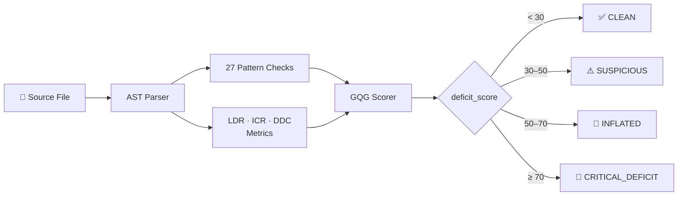

<p align="center">
  
</p>

<h1 align="center">AI-SLOP Detector</h1>

<p align="center">
  <a href="https://pypi.org/project/ai-slop-detector/"></a>
  <a href="https://pypi.org/project/ai-slop-detector/"></a>
  <a href="https://www.python.org/downloads/"></a>
  <a href="https://opensource.org/licenses/MIT"></a>
  <br/>
  <a href="https://github.com/flamehaven01/AI-SLOP-Detector/actions"></a>
  <a href="https://github.com/flamehaven01/AI-SLOP-Detector/actions"></a>
  <a href="htmlcov/"></a>
  <a href="https://github.com/psf/black"></a>
  <a href="https://github.com/flamehaven01/AI-SLOP-Detector/issues"></a>
</p>

<p align="center"><b>Catches the slop that AI produces — before it reaches production.</b></p>

<p align="center">
The problem isn't that AI writes code.<br/>
The problem is the specific class of defects AI reliably introduces:<br/>
unimplemented stubs, disconnected pipelines, phantom imports, and buzzword-heavy noise.<br/>
<br/>
<b>The code speaks for itself.</b>
</p>

---

**Navigation:**
[Quick Start](#quick-start) •
[How It Works](#how-it-works) •
[What It Detects](#what-it-detects) •
[Scoring](#scoring-model) •
[Key Features](#key-features) •
[CI/CD](#cicd-integration) •
[Config](#configuration) •
[VS Code](#vs-code-extension) •
[Changelog](CHANGELOG.md) •
[Release Notes](docs/RELEASE_NOTES.md)

---

## Quick Start

```bash
pip install ai-slop-detector

slop-detector mycode.py               # single file
slop-detector --project ./src         # entire project
slop-detector mycode.py --json        # machine-readable output
slop-detector --project . --ci-mode hard --ci-report  # CI gate

# Optional extras
pip install "ai-slop-detector[js]"       # JS/TS tree-sitter analysis
pip install "ai-slop-detector[ml]"       # ML secondary signal

# No install required
uvx ai-slop-detector mycode.py
```

<p align="center">
  
</p>

---

## How It Works


```mermaid
flowchart LR
    A[📄 Source File] --> B[AST Parser]
    B --> C[27 Pattern Checks]
    B --> D[LDR · ICR · DDC\nMetrics]
    C --> E[GQG Scorer]
    D --> E
    E --> F{deficit_score}
    F -->|< 30| G[✅ CLEAN]
    F -->|30–50| H[⚠️ SUSPICIOUS]
    F -->|50–70| I[🔶 INFLATED]
    F -->|≥ 70| J[🚨 CRITICAL_DEFICIT]
```

Every file goes through three independent measurement axes **and** 27 pattern
checks. The results are combined via a weighted geometric mean — a near-zero in
any single dimension pulls the overall score down regardless of other dimensions.

Full specification: [docs/HOW_IT_WORKS.md](docs/HOW_IT_WORKS.md) · [docs/MATH_MODELS.md](docs/MATH_MODELS.md)

---

## What It Detects

**27 patterns across 5 categories.** Full catalog: [docs/PATTERNS.md](docs/PATTERNS.md)

| Category | Patterns | Signal |
|---|---|---|
| **Placeholder** | `empty_except`, `not_implemented`, `pass_placeholder`, `ellipsis_placeholder`, `return_none_placeholder`, `return_constant_stub`, `todo_comment`, `fixme_comment`, `hack_comment`, `xxx_comment`, `interface_only_class` | Unfinished / scaffolded code |
| **Structural** | `bare_except`, `mutable_default_arg`, `star_import`, `global_statement` | Anti-patterns |
| **Cross-Language** | `js_push`, `java_equals`, `ruby_each`, `go_print`, `csharp_length`, `php_strlen` | Wrong-language syntax |
| **Python Advanced** | `god_function`, `dead_code`, `deep_nesting`, `lint_escape`, `function_clone_cluster`, `placeholder_variable_naming` | Structural complexity + evasion |
| **Phantom** | `phantom_import` | Hallucinated packages |

**Three metric axes per file:**

| Metric | What it measures |
|---|---|
| **LDR** (Logic Density Ratio) | `logic_lines / total_lines` — code vs. whitespace/comments |
| **ICR** (Inflation Check) | `jargon_density × complexity_modifier` — buzzword weight |
| **DDC** (Dependency Check) | `used_imports / total_imports` — import utilization |

---

## Scoring Model

```
purity        = exp(-0.5 × n_critical_patterns)
quality (GQG) = exp( Σ wᵢ·ln(dimᵢ) / Σ wᵢ )   — weighted geometric mean
deficit_score = 100 × (1 − quality) + pattern_penalty
```

| Score | Status |
|---|---|
| ≥ 70 | `CRITICAL_DEFICIT` |
| ≥ 50 | `INFLATED_SIGNAL` |
| ≥ 30 | `SUSPICIOUS` |
| < 30 | `CLEAN` |

Default weights: `ldr=0.40 · inflation=0.30 · ddc=0.30` (purity=0.10 fixed, not calibrated)
Project aggregation uses SR9 conservative weighting: `0.6 × min + 0.4 × mean`

Full specification: [docs/MATH_MODELS.md](docs/MATH_MODELS.md)

---

## Key Features

**Self-Calibration** — the tool learns your codebase
```bash
slop-detector . --self-calibrate               # see what your history recommends
slop-detector . --self-calibrate --apply-calibration  # write to .slopconfig.yaml
```
Grid-searches 200+ weight combinations using your run history. Only applies when
confidence gap between top two candidates exceeds 0.10.
[docs/SELF_CALIBRATION.md →](docs/SELF_CALIBRATION.md)

---

**History Tracking** — longitudinal quality analysis
```bash
slop-detector mycode.py --show-history   # per-file trend
slop-detector --history-trends           # 7-day project aggregate
slop-detector --export-history data.jsonl
```
Every run auto-recorded to `~/.slop-detector/history.db`. The history database is
the training signal for ML self-calibration.
[docs/HISTORY_TRACKING.md →](docs/HISTORY_TRACKING.md)

---

**Adversarial Validation (SPAR-Code)** — ground-truth regression guard
```bash
fhval spar          # 3-layer adversarial check
fhval spar --layer a   # known-pattern anchors
fhval spar --layer c   # existence probes
```
Verifies each metric is measuring what it claims. Catches calibration drift
before it reaches production.

---

**Structural Coherence** — project-level signal
```python
project = detector.analyze_project("./src")
print(project.structural_coherence)  # 0.0 – 1.0
```
Experimental. Use for longitudinal comparison within a project, not as an
absolute gate. [docs/ARCHITECTURE.md →](docs/ARCHITECTURE.md)

---

## CI/CD Integration

```bash
# Soft — informational, never fails build
slop-detector --project . --ci-mode soft --ci-report

# Hard — fails build at deficit_score >= 70 or critical_patterns >= 3
slop-detector --project . --ci-mode hard --ci-report

# Quarantine — escalates repeat offenders after 3 violations
slop-detector --project . --ci-mode quarantine --ci-report
```

**GitHub Actions:**
```yaml
- name: Slop Gate
  run: |
    pip install ai-slop-detector
    slop-detector --project . --ci-mode hard --ci-report
```

[CI/CD Integration Guide →](docs/CI_CD.md)

---

## Configuration

```yaml
# .slopconfig.yaml
weights:
  ldr: 0.40
  inflation: 0.35
  ddc: 0.25

patterns:
  god_function:
    domain_overrides:
      - function_pattern: "check_node"   # AST walker — complex by design
        complexity_threshold: 30
        lines_threshold: 200

ignore:
  - "tests/**"
  - "**/__init__.py"
```

[Full Configuration Guide →](docs/CONFIGURATION.md) · [Config Examples →](docs/CONFIG_EXAMPLES.md)

---

## VS Code Extension

Real-time inline diagnostics, debounced lint-on-type, ML score and Clone Detection in status bar.

**Commands:** Analyze File · Analyze Workspace · Auto-Fix · Show Gate Decision · History Trends

Install from the [VS Code Marketplace](https://marketplace.visualstudio.com/items?itemName=Flamehaven.vscode-slop-detector)
or build locally:

```bash
cd vscode-extension && npm install && npx vsce package
```

---

## Release Highlights

| Version | Highlights |
|---|---|
| **v3.1.2** | `data_collector` refactor; slopconfig gap fill; 43/43 self-scan CLEAN |
| **v3.1.1** | Clone Detection in Core Metrics table; table style unification; VS Code UX |
| **v3.1.0** | 3 new adversarial patterns (`function_clone_cluster`, `placeholder_variable_naming`, `return_constant_stub`); GQG calibrator alignment; fhval SPAR-Code |
| **v3.0.2** | Phantom import 3-tier classification; `__init__.py` LDR fix; `god_function` LOW demotion |
| **v3.0.0** | Geometric mean scorer (GQG); `purity` dimension; DCF per-file; structural coherence |
| **v2.9.3** | Self-calibration engine; weight grid-search from usage history |
| **v2.9.0** | `phantom_import` CRITICAL detection; history auto-tracking |

[Full Release Notes →](docs/RELEASE_NOTES.md) · [Changelog →](CHANGELOG.md)

---

## Development

```bash
git clone https://github.com/flamehaven01/AI-SLOP-Detector.git
cd AI-SLOP-Detector
pip install -e ".[dev]"
pytest tests/ -v --cov
black src/ tests/
ruff check src/ tests/
```

[Development Guide →](docs/DEVELOPMENT.md)

---

## License

MIT — see [LICENSE](LICENSE).

---

<p align="center">
  <b>Flamehaven Labs</b> •
  <a href="https://github.com/flamehaven01/AI-SLOP-Detector/issues">Issues</a> •
  <a href="https://github.com/flamehaven01/AI-SLOP-Detector/discussions">Discussions</a> •
  <a href="docs/">Docs</a>
</p>
