# AI-SLOP Detector - How It Works

Visual guide to understanding the AI-SLOP detection process.

---

## System Overview

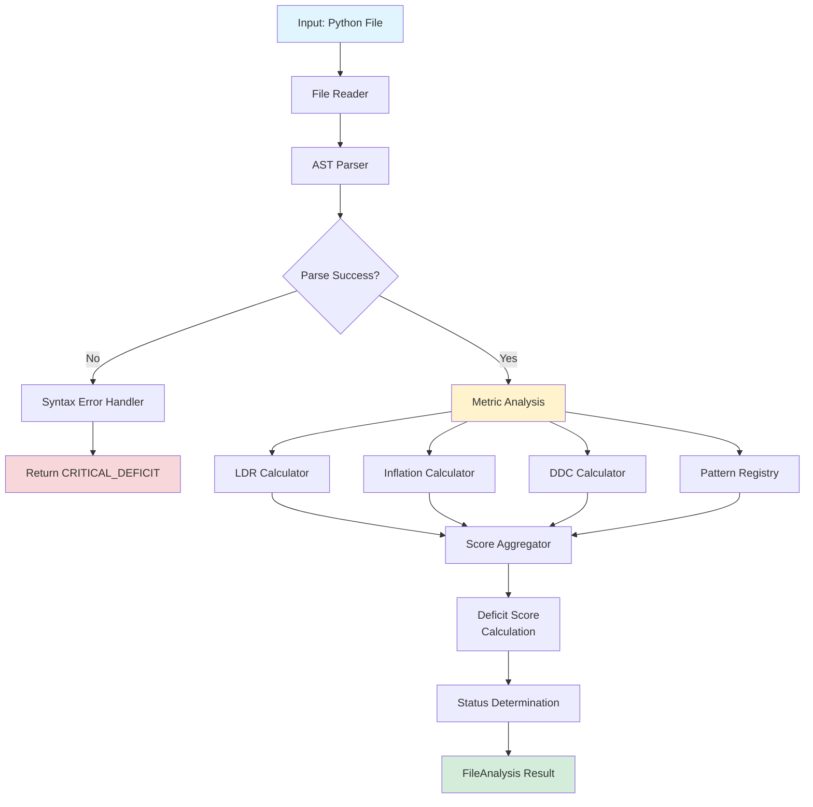

---

## Analysis Pipeline

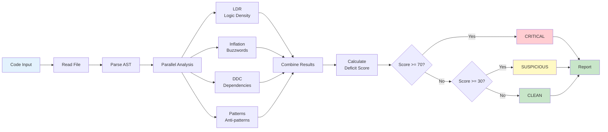

---

## LDR (Logic Density Ratio) Calculation

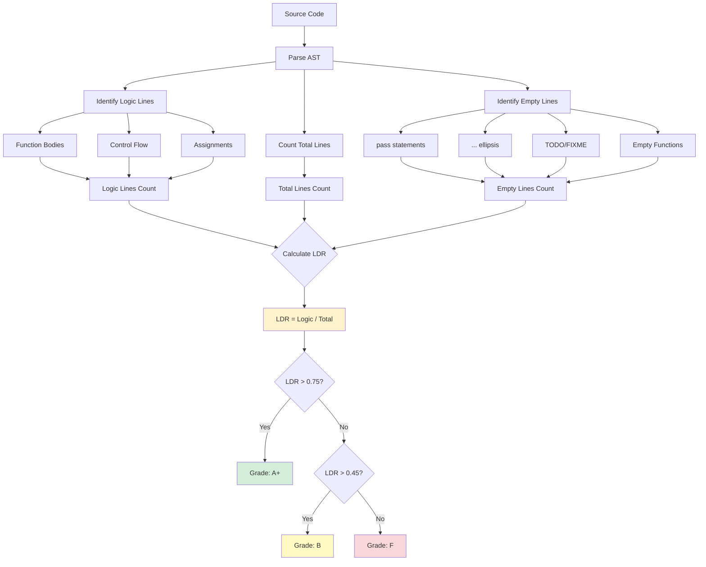

---

## Inflation Detection Process

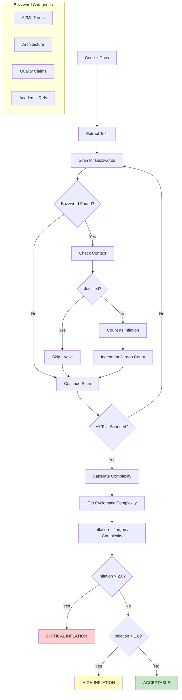

---

## Pattern Detection Flow

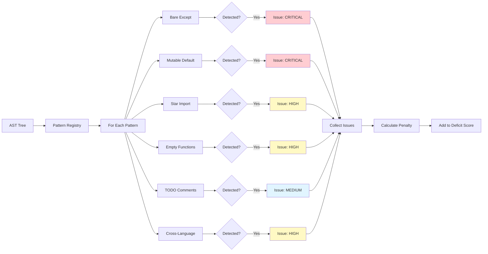

---

## Deficit Score Calculation

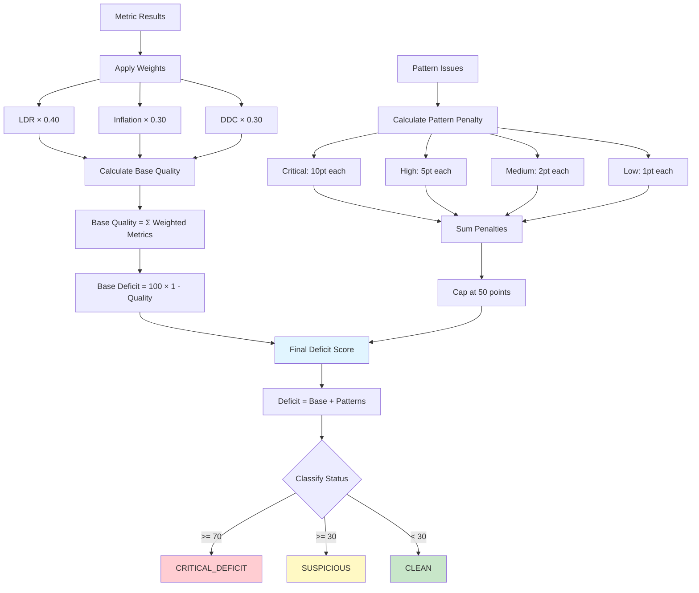

---

## Real-World Example Flow

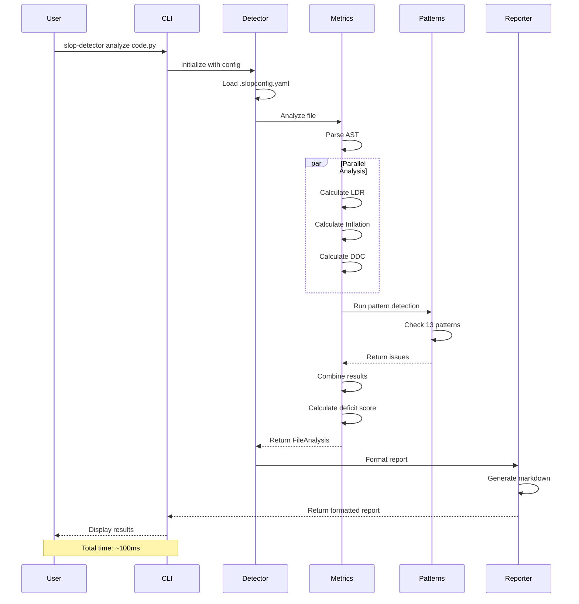

---

## Test Case Detection Example

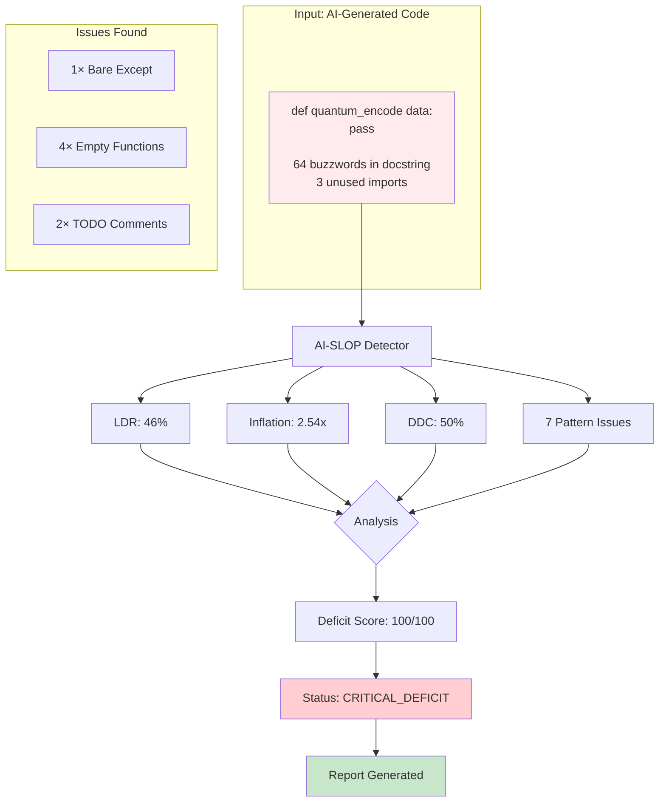

---

## Project Scanning Flow

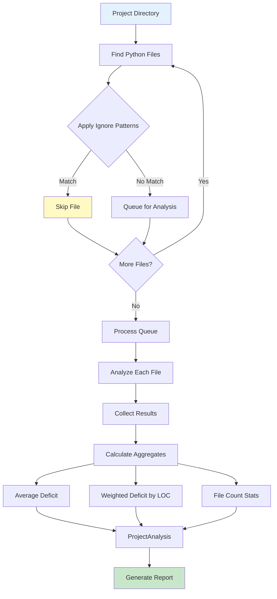

---

## Configuration Hierarchy

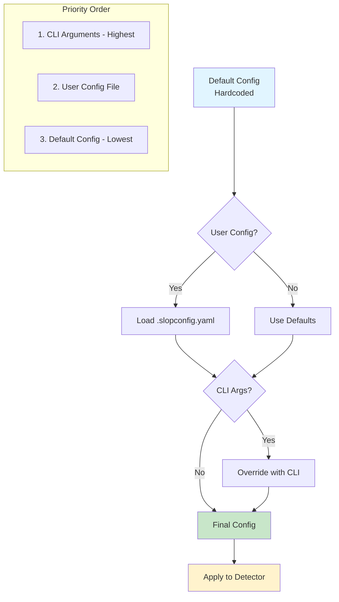

---

## Integration Points

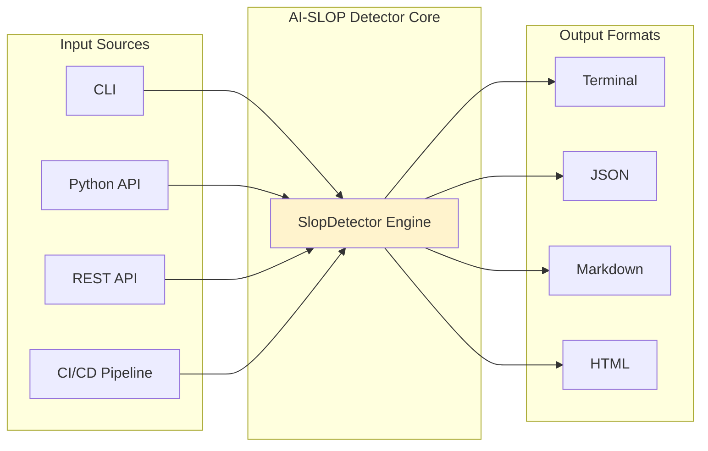

---

## Performance Optimization

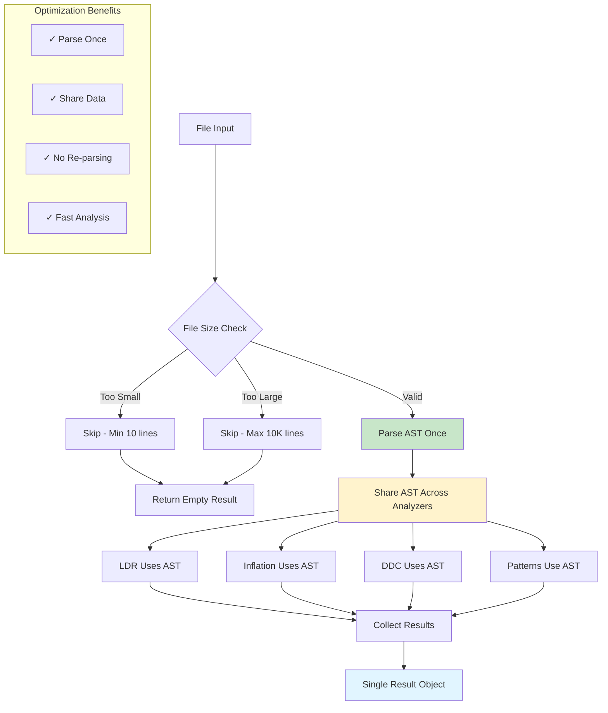

---

## Error Handling Flow

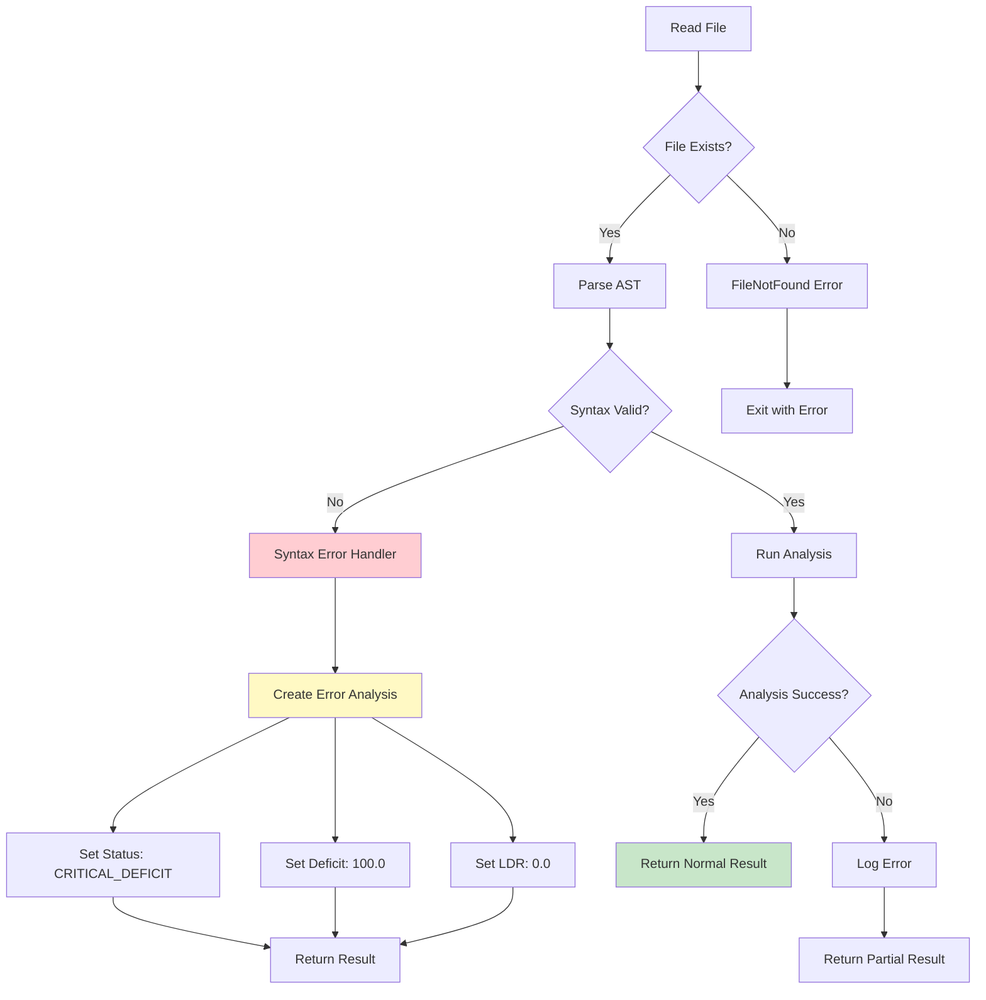

---

**Generated:** 2026-01-12  
**Version:** 2.6.1
