# AI-SLOP Detector - How It Works

Visual guide to understanding the AI-SLOP detection process.

---

## System Overview

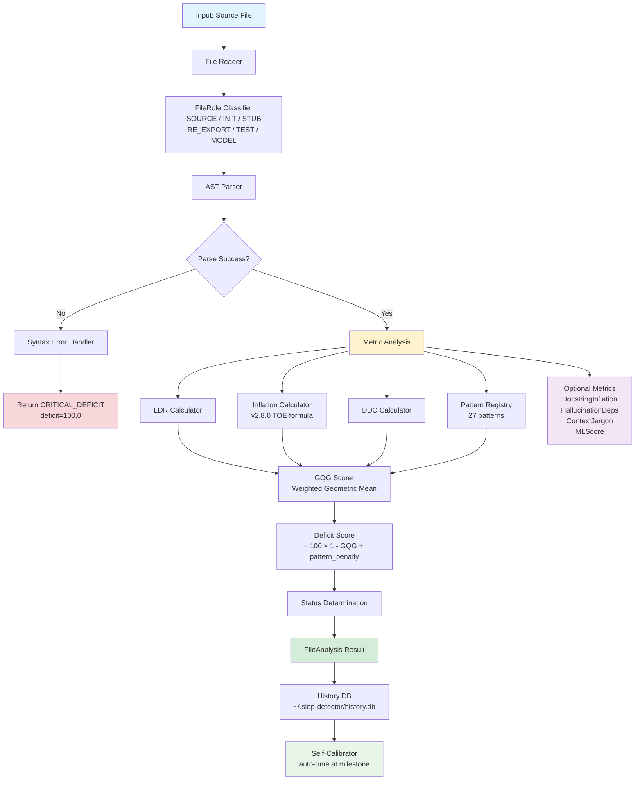
```mermaid
graph TB
    A[Input: Source File] --> B[File Reader]
    B --> R[FileRole Classifier<br/>SOURCE / INIT / STUB<br/>RE_EXPORT / TEST / MODEL]
    R --> C[AST Parser]
    C --> D{Parse Success?}
    D -->|No| E[Syntax Error Handler]
    D -->|Yes| F[Metric Analysis]

    E --> Z[Return CRITICAL_DEFICIT<br/>deficit=100.0]

    F --> G[LDR Calculator]
    F --> H[Inflation Calculator<br/>v2.8.0 TOE formula]
    F --> I[DDC Calculator]
    F --> J[Pattern Registry<br/>27 patterns]
    F --> OPT[Optional Metrics<br/>DocstringInflation<br/>HallucinationDeps<br/>ContextJargon<br/>MLScore]

    G --> K[GQG Scorer<br/>Weighted Geometric Mean]
    H --> K
    I --> K
    J --> K

    K --> L[Deficit Score<br/>= 100 × 1 - GQG + pattern_penalty]
    L --> M[Status Determination]
    M --> N[FileAnalysis Result]

    N --> HIST[History DB<br/>~/.slop-detector/history.db]
    HIST --> CAL[Self-Calibrator<br/>auto-tune at milestone]

    style A fill:#e1f5ff
    style N fill:#d4edda
    style Z fill:#f8d7da
    style F fill:#fff3cd
    style OPT fill:#f3e5f5
    style CAL fill:#e8f5e9
```

---

## Analysis Pipeline

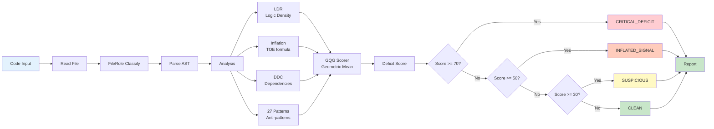
```mermaid
flowchart LR
    A[Code Input] --> B[Read File]
    B --> RC[FileRole Classify]
    RC --> C[Parse AST]
    C --> D[Analysis]

    D --> E1[LDR<br/>Logic Density]
    D --> E2[Inflation<br/>TOE formula]
    D --> E3[DDC<br/>Dependencies]
    D --> E4[27 Patterns<br/>Anti-patterns]

    E1 --> F[GQG Scorer<br/>Geometric Mean]
    E2 --> F
    E3 --> F
    E4 --> F

    F --> G[Deficit Score]
    G --> H{Score >= 70?}

    H -->|Yes| I[CRITICAL_DEFICIT]
    H -->|No| J{Score >= 50?}
    J -->|Yes| JJ[INFLATED_SIGNAL]
    J -->|No| K{Score >= 30?}
    K -->|Yes| KK[SUSPICIOUS]
    K -->|No| L[CLEAN]

    I --> M[Report]
    JJ --> M
    KK --> M
    L --> M

    style A fill:#e3f2fd
    style M fill:#c8e6c9
    style I fill:#ffcdd2
    style JJ fill:#ffccbc
    style KK fill:#fff9c4
    style L fill:#c8e6c9
```

---

## LDR (Logic Density Ratio) Calculation

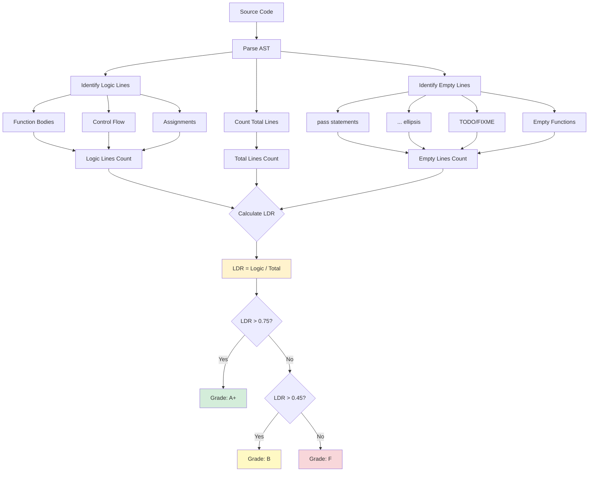
```mermaid
flowchart TD
    A[Source Code] --> B[Parse AST]
    B --> C[Count Total Lines]
    B --> D[Identify Logic Lines]
    B --> E[Identify Empty Lines]
    
    D --> D1[Function Bodies]
    D --> D2[Control Flow]
    D --> D3[Assignments]
    
    E --> E1[pass statements]
    E --> E2[... ellipsis]
    E --> E3[TODO/FIXME]
    E --> E4[Empty Functions]
    
    C --> F[Total Lines Count]
    D1 --> G[Logic Lines Count]
    D2 --> G
    D3 --> G
    
    G --> H{Calculate LDR}
    F --> H
    E1 --> I[Empty Lines Count]
    E2 --> I
    E3 --> I
    E4 --> I
    I --> H
    
    H --> J[LDR = Logic / Total]
    J --> K{LDR > 0.75?}
    
    K -->|Yes| L[Grade: A+]
    K -->|No| M{LDR > 0.45?}
    M -->|Yes| N[Grade: B]
    M -->|No| O[Grade: F]
    
    style J fill:#fff3cd
    style L fill:#d4edda
    style N fill:#fff9c4
    style O fill:#f8d7da
```

---

## Inflation Detection Process

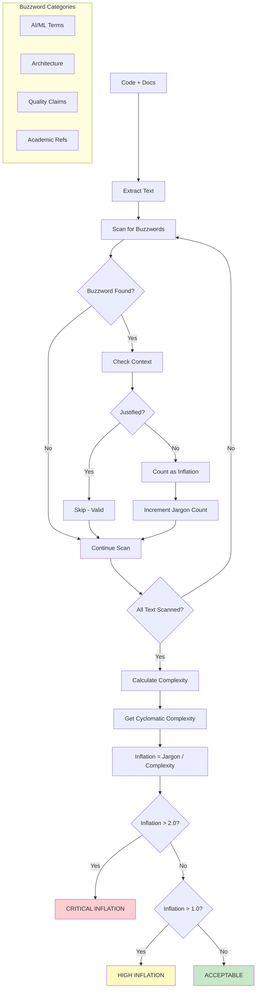
```mermaid
flowchart TD
    A[Code + Docs] --> B[Extract Text]
    B --> C[Scan for Buzzwords]
    
    C --> D{Buzzword Found?}
    D -->|Yes| E[Check Context]
    D -->|No| F[Continue Scan]
    
    E --> G{Justified?}
    G -->|Yes| H[Skip - Valid]
    G -->|No| I[Count as Inflation]
    
    H --> F
    I --> J[Increment Jargon Count]
    J --> F
    
    F --> K{All Text Scanned?}
    K -->|No| C
    K -->|Yes| L[Calculate Complexity]
    
    L --> M[Get Cyclomatic Complexity]
    M --> N[Inflation = Jargon / Complexity]
    
    N --> O{Inflation > 2.0?}
    O -->|Yes| P[CRITICAL INFLATION]
    O -->|No| Q{Inflation > 1.0?}
    Q -->|Yes| R[HIGH INFLATION]
    Q -->|No| S[ACCEPTABLE]
    
    style P fill:#ffcdd2
    style R fill:#fff9c4
    style S fill:#c8e6c9
    
    subgraph "Buzzword Categories"
    T1[AI/ML Terms]
    T2[Architecture]
    T3[Quality Claims]
    T4[Academic Refs]
    end
```

---

## Pattern Detection Flow

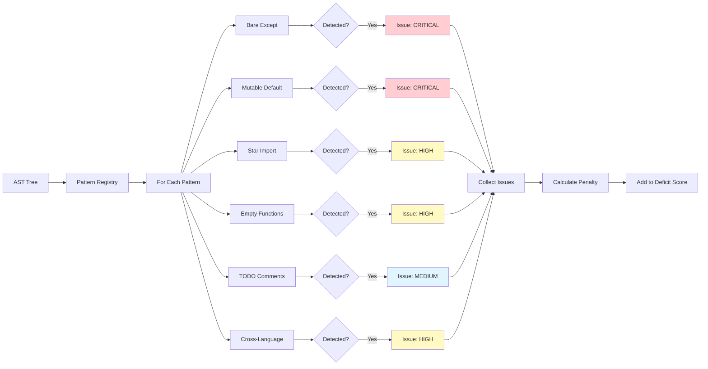
```mermaid
flowchart LR
    A[AST Tree] --> B[Pattern Registry]
    B --> C[For Each Pattern]
    
    C --> D1[Bare Except]
    C --> D2[Mutable Default]
    C --> D3[Star Import]
    C --> D4[Empty Functions]
    C --> D5[TODO Comments]
    C --> D6[Cross-Language]
    
    D1 --> E1{Detected?}
    D2 --> E2{Detected?}
    D3 --> E3{Detected?}
    D4 --> E4{Detected?}
    D5 --> E5{Detected?}
    D6 --> E6{Detected?}
    
    E1 -->|Yes| F1[Issue: CRITICAL]
    E2 -->|Yes| F2[Issue: CRITICAL]
    E3 -->|Yes| F3[Issue: HIGH]
    E4 -->|Yes| F4[Issue: HIGH]
    E5 -->|Yes| F5[Issue: MEDIUM]
    E6 -->|Yes| F6[Issue: HIGH]
    
    F1 --> G[Collect Issues]
    F2 --> G
    F3 --> G
    F4 --> G
    F5 --> G
    F6 --> G
    
    G --> H[Calculate Penalty]
    H --> I[Add to Deficit Score]
    
    style F1 fill:#ffcdd2
    style F2 fill:#ffcdd2
    style F3 fill:#fff9c4
    style F4 fill:#fff9c4
    style F5 fill:#e1f5ff
    style F6 fill:#fff9c4
```

---

## Deficit Score Calculation

The scorer uses a **weighted geometric mean** (GQG), not an arithmetic sum.
A near-zero in any single dimension pulls the overall quality down regardless
of other dimensions.

```
purity        = exp(-0.5 × n_critical_patterns)
quality (GQG) = exp( Σ wᵢ·ln(dimᵢ) / Σ wᵢ )   — weighted geometric mean
deficit_score = 100 × (1 − GQG) + pattern_penalty
```

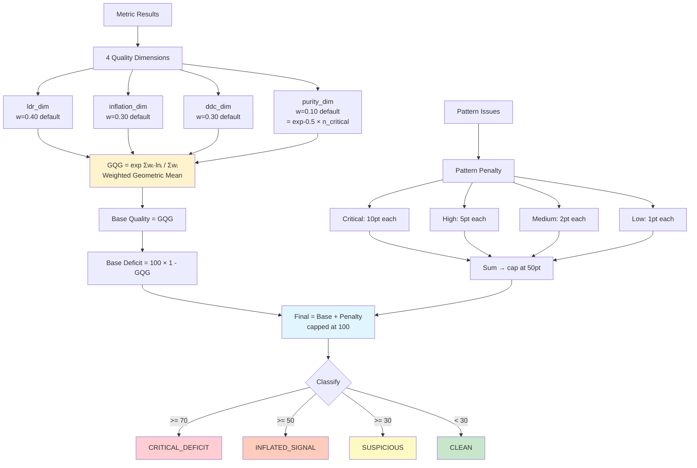
```mermaid
flowchart TD
    A[Metric Results] --> B[4 Quality Dimensions]

    B --> C[ldr_dim<br/>w=0.40 default]
    B --> D[inflation_dim<br/>w=0.30 default]
    B --> E[ddc_dim<br/>w=0.30 default]
    B --> PUR[purity_dim<br/>w=0.10 default<br/>= exp-0.5 × n_critical]

    C --> F[GQG = exp Σwᵢ·lnᵢ / Σwᵢ<br/>Weighted Geometric Mean]
    D --> F
    E --> F
    PUR --> F

    F --> G[Base Quality = GQG]
    G --> H[Base Deficit = 100 × 1 - GQG]

    I[Pattern Issues] --> J[Pattern Penalty]
    J --> K[Critical: 10pt each]
    J --> L[High: 5pt each]
    J --> M[Medium: 2pt each]
    J --> N[Low: 1pt each]

    K --> O[Sum → cap at 50pt]
    L --> O
    M --> O
    N --> O

    H --> Q[Final = Base + Penalty<br/>capped at 100]
    O --> Q

    Q --> S{Classify}
    S -->|>= 70| T[CRITICAL_DEFICIT]
    S -->|>= 50| TT[INFLATED_SIGNAL]
    S -->|>= 30| U[SUSPICIOUS]
    S -->|< 30| V[CLEAN]

    style T fill:#ffcdd2
    style TT fill:#ffccbc
    style U fill:#fff9c4
    style V fill:#c8e6c9
    style Q fill:#e1f5ff
    style F fill:#fff3cd
```

Weights are auto-tuned by the self-calibrator. Project-level aggregation
uses SR9 conservative weighting: `0.6 × min_file + 0.4 × mean`.

---

## Real-World Example Flow

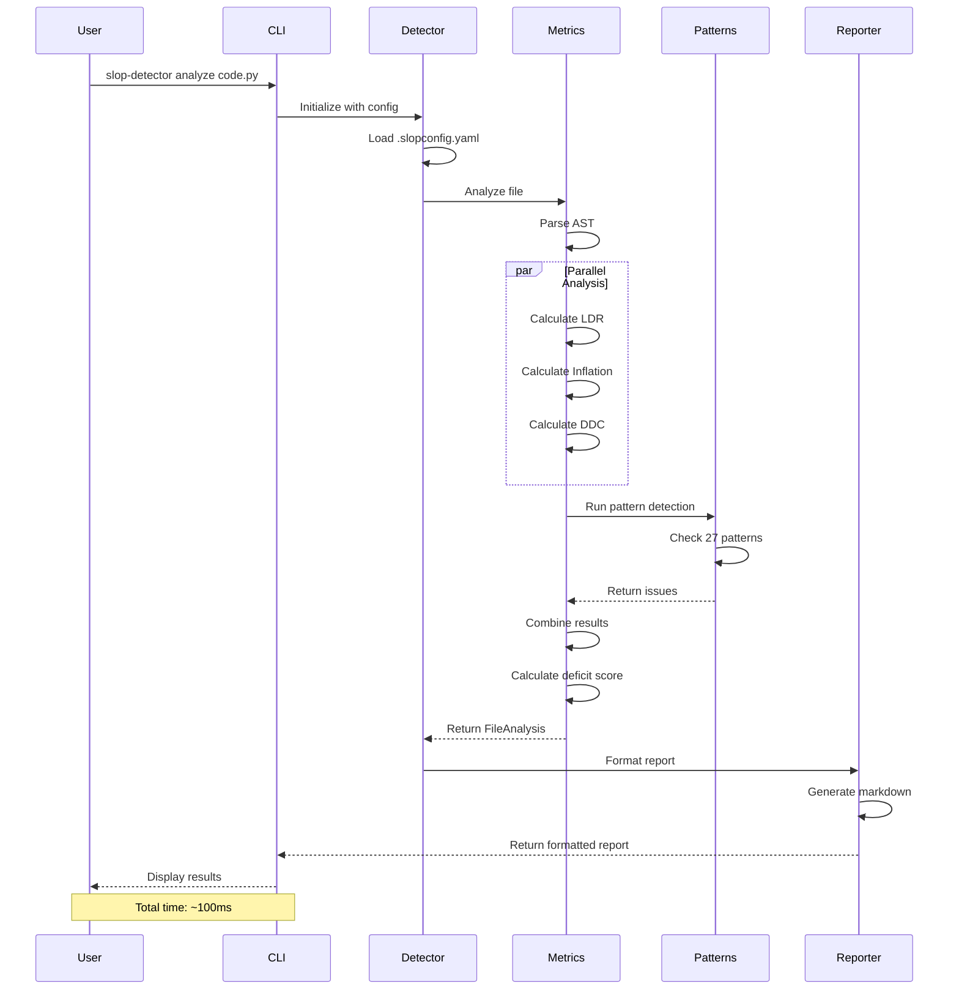
```mermaid
sequenceDiagram
    participant U as User
    participant CLI as CLI
    participant D as Detector
    participant M as Metrics
    participant P as Patterns
    participant R as Reporter
    
    U->>CLI: slop-detector analyze code.py
    CLI->>D: Initialize with config
    D->>D: Load .slopconfig.yaml
    
    D->>M: Analyze file
    M->>M: Parse AST
    
    par Parallel Analysis
        M->>M: Calculate LDR
        M->>M: Calculate Inflation
        M->>M: Calculate DDC
    end
    
    M->>P: Run pattern detection
    P->>P: Check 27 patterns
    P-->>M: Return issues
    
    M->>M: Combine results
    M->>M: Calculate deficit score
    M-->>D: Return FileAnalysis
    
    D->>R: Format report
    R->>R: Generate markdown
    R-->>CLI: Return formatted report
    CLI-->>U: Display results
    
    Note over U,CLI: Total time: ~100ms
```

---

## Test Case Detection Example

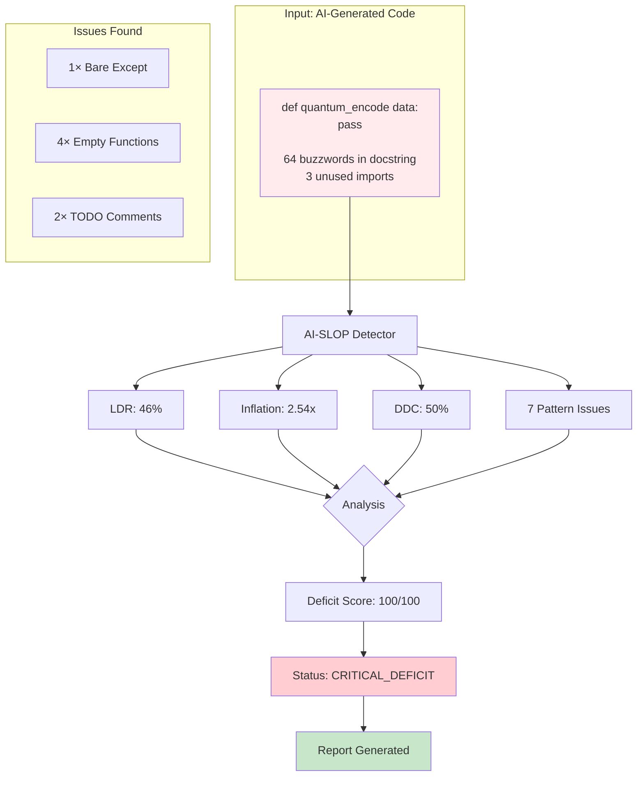
```mermaid
graph TB
    subgraph "Input: AI-Generated Code"
    A[def quantum_encode data:<br/>    pass<br/><br/>64 buzzwords in docstring<br/>3 unused imports]
    end
    
    A --> B[AI-SLOP Detector]
    
    B --> C[LDR: 46%]
    B --> D[Inflation: 2.54x]
    B --> E[DDC: 50%]
    B --> F[7 Pattern Issues]
    
    C --> G{Analysis}
    D --> G
    E --> G
    F --> G
    
    G --> H[Deficit Score: 100/100]
    H --> I[Status: CRITICAL_DEFICIT]
    
    I --> J[Report Generated]
    
    style A fill:#ffebee
    style I fill:#ffcdd2
    style J fill:#c8e6c9
    
    subgraph "Issues Found"
    F1[1× Bare Except]
    F2[4× Empty Functions]
    F3[2× TODO Comments]
    end
```

---

## Self-Calibration Flow

Every scan is auto-recorded to `~/.slop-detector/history.db`. At every
`CALIBRATION_MILESTONE` (= 10) multiple of total records, the self-calibrator
runs automatically — no manual command required.

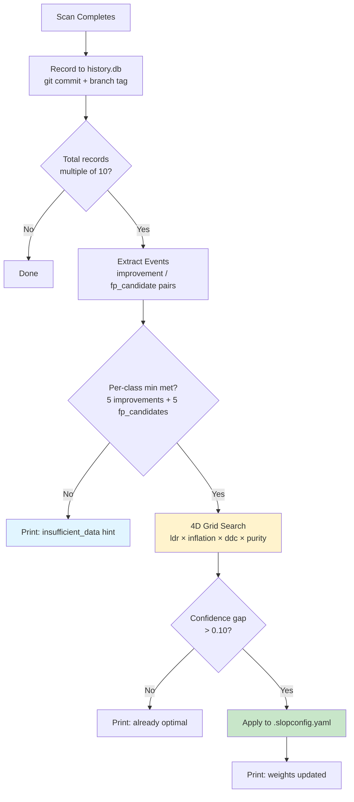
```mermaid
flowchart TD
    A[Scan Completes] --> B[Record to history.db<br/>git commit + branch tag]
    B --> C{Total records<br/>multiple of 10?}
    C -->|No| END[Done]
    C -->|Yes| D[Extract Events<br/>improvement / fp_candidate pairs]
    D --> E{Per-class min met?<br/>5 improvements + 5 fp_candidates}
    E -->|No| F[Print: insufficient_data hint]
    E -->|Yes| G[4D Grid Search<br/>ldr × inflation × ddc × purity]
    G --> H{Confidence gap<br/>> 0.10?}
    H -->|No| I[Print: already optimal]
    H -->|Yes| J[Apply to .slopconfig.yaml]
    J --> K[Print: weights updated]

    style J fill:#c8e6c9
    style G fill:#fff3cd
    style F fill:#e1f5ff
```

---

## Project Scanning Flow

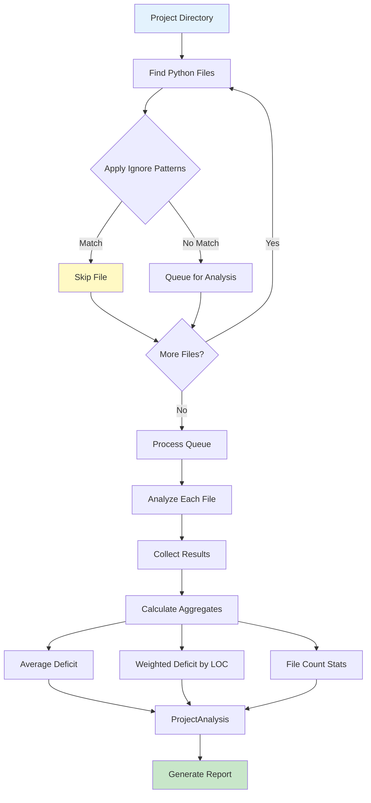
```mermaid
flowchart TD
    A[Project Directory] --> B[Find Python Files]
    B --> C{Apply Ignore Patterns}
    
    C -->|Match| D[Skip File]
    C -->|No Match| E[Queue for Analysis]
    
    D --> F{More Files?}
    E --> F
    
    F -->|Yes| B
    F -->|No| G[Process Queue]
    
    G --> H[Analyze Each File]
    H --> I[Collect Results]
    
    I --> J[Calculate Aggregates]
    J --> K[Average Deficit]
    J --> L[Weighted Deficit by LOC]
    J --> M[File Count Stats]
    
    K --> N[ProjectAnalysis]
    L --> N
    M --> N
    
    N --> O[Generate Report]
    
    style A fill:#e3f2fd
    style O fill:#c8e6c9
    style D fill:#fff9c4
```

---

## Configuration Hierarchy

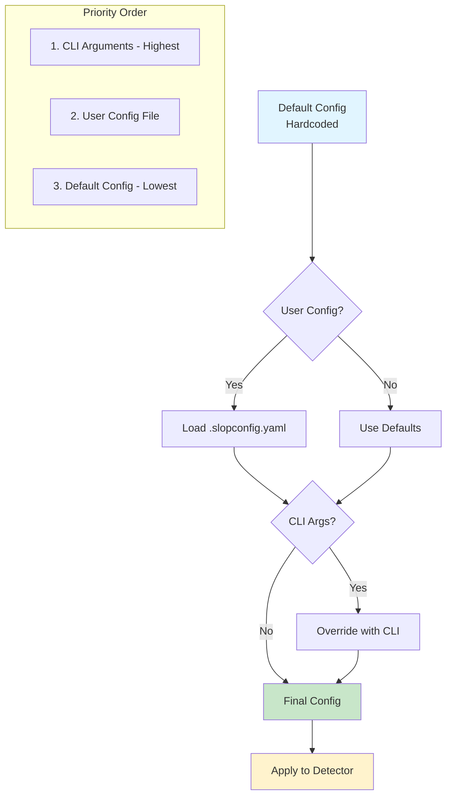
```mermaid
flowchart TD
    A[Default Config<br/>Hardcoded] --> B{User Config?}
    
    B -->|Yes| C[Load .slopconfig.yaml]
    B -->|No| D[Use Defaults]
    
    C --> E{CLI Args?}
    D --> E
    
    E -->|Yes| F[Override with CLI]
    E -->|No| G[Final Config]
    
    F --> G
    
    G --> H[Apply to Detector]
    
    style A fill:#e1f5ff
    style G fill:#c8e6c9
    style H fill:#fff3cd
    
    subgraph "Priority Order"
    P1[1. CLI Arguments - Highest]
    P2[2. User Config File]
    P3[3. Default Config - Lowest]
    end
```

---

## Integration Points

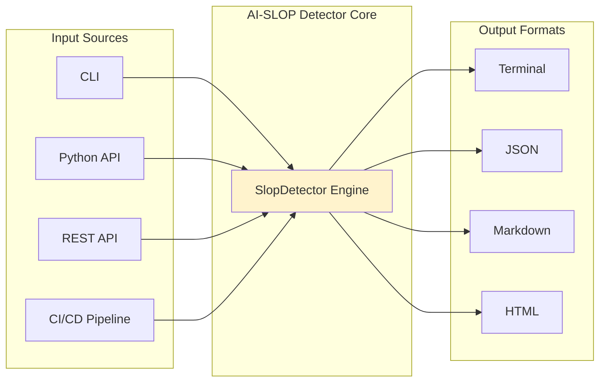
```mermaid
graph LR
    subgraph "Input Sources"
    A1[CLI]
    A2[Python API]
    A3[REST API]
    A4[CI/CD Pipeline]
    end
    
    subgraph "AI-SLOP Detector Core"
    B[SlopDetector Engine]
    end
    
    subgraph "Output Formats"
    C1[Terminal]
    C2[JSON]
    C3[Markdown]
    C4[HTML]
    end
    
    A1 --> B
    A2 --> B
    A3 --> B
    A4 --> B
    
    B --> C1
    B --> C2
    B --> C3
    B --> C4
    
    style B fill:#fff3cd
```

---

## Performance Optimization

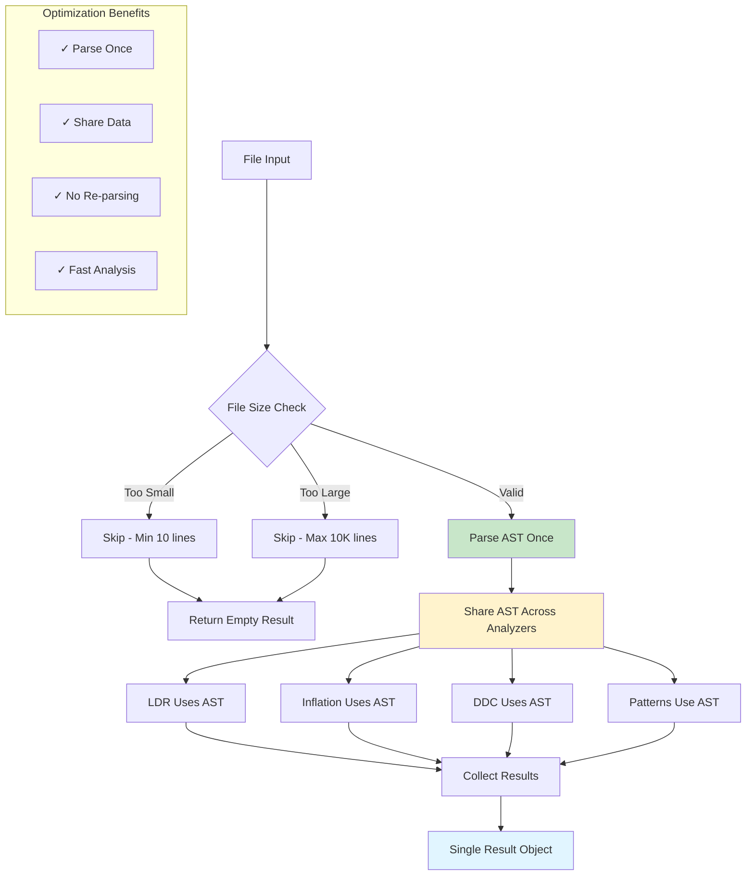
```mermaid
flowchart TD
    A[File Input] --> B{File Size Check}
    
    B -->|Too Small| C[Skip - Min 10 lines]
    B -->|Too Large| D[Skip - Max 10K lines]
    B -->|Valid| E[Parse AST Once]
    
    C --> Z[Return Empty Result]
    D --> Z
    
    E --> F[Share AST Across Analyzers]
    
    F --> G1[LDR Uses AST]
    F --> G2[Inflation Uses AST]
    F --> G3[DDC Uses AST]
    F --> G4[Patterns Use AST]
    
    G1 --> H[Collect Results]
    G2 --> H
    G3 --> H
    G4 --> H
    
    H --> I[Single Result Object]
    
    style E fill:#c8e6c9
    style F fill:#fff3cd
    style I fill:#e1f5ff
    
    subgraph "Optimization Benefits"
    O1[✓ Parse Once]
    O2[✓ Share Data]
    O3[✓ No Re-parsing]
    O4[✓ Fast Analysis]
    end
```

---

## Error Handling Flow

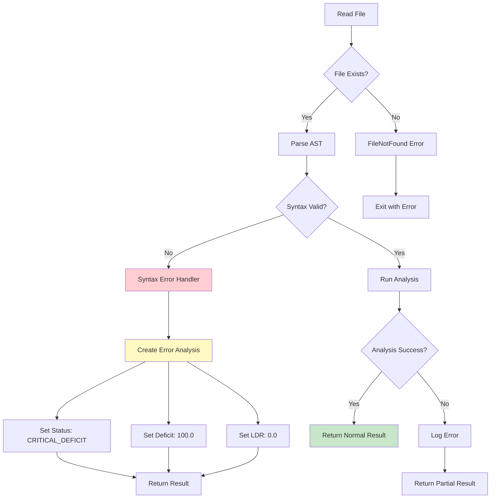
```mermaid
flowchart TD
    A[Read File] --> B{File Exists?}
    B -->|No| C[FileNotFound Error]
    B -->|Yes| D[Parse AST]
    
    D --> E{Syntax Valid?}
    E -->|No| F[Syntax Error Handler]
    E -->|Yes| G[Run Analysis]
    
    F --> H[Create Error Analysis]
    H --> I[Set Status: CRITICAL_DEFICIT]
    H --> J[Set Deficit: 100.0]
    H --> K[Set LDR: 0.0]
    
    I --> L[Return Result]
    J --> L
    K --> L
    
    G --> M{Analysis Success?}
    M -->|Yes| N[Return Normal Result]
    M -->|No| O[Log Error]
    O --> P[Return Partial Result]
    
    C --> Q[Exit with Error]
    
    style F fill:#ffcdd2
    style H fill:#fff9c4
    style N fill:#c8e6c9
```

---

**Generated:** 2026-04-13  
**Version:** 3.5.0
